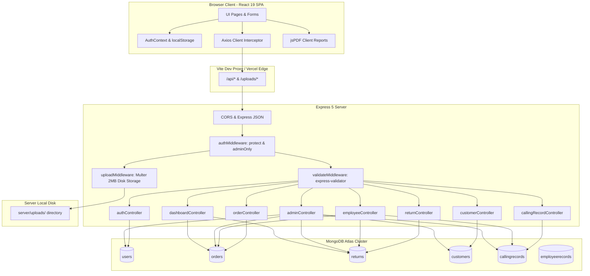
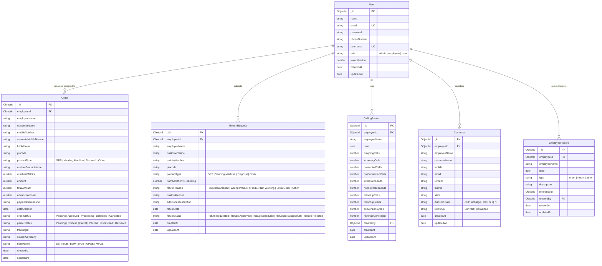
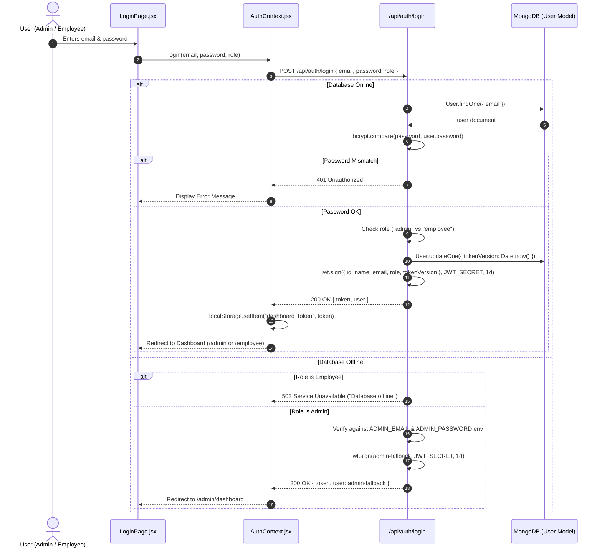
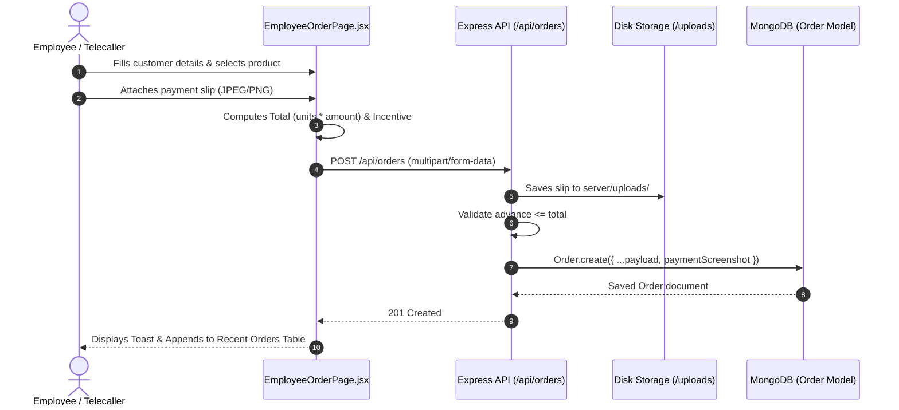
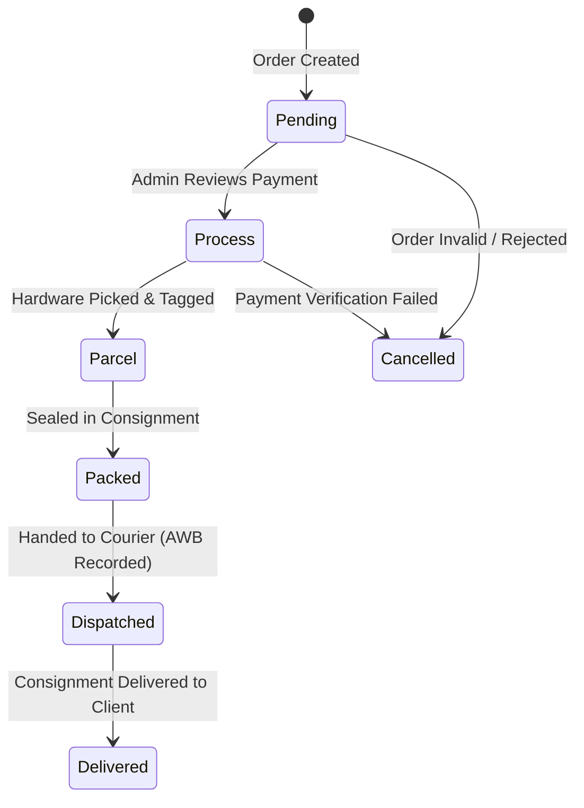
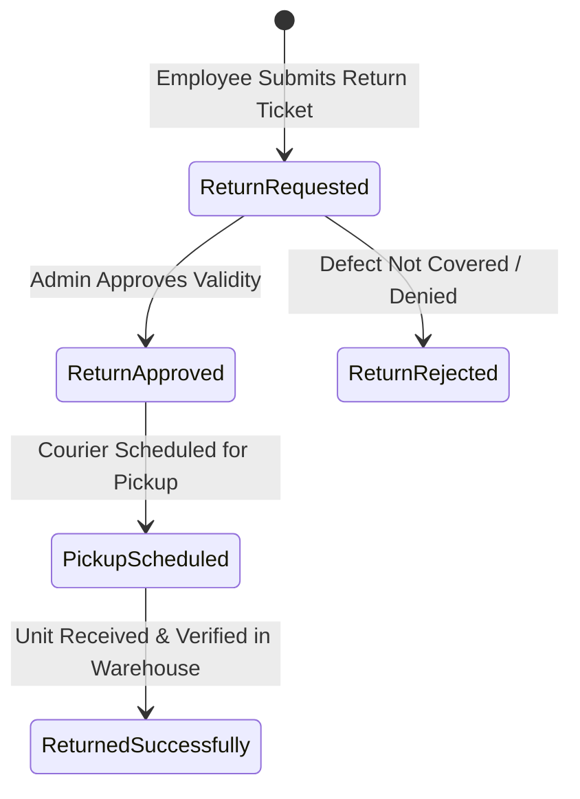
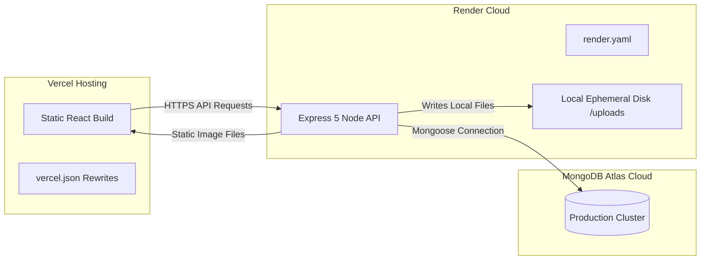
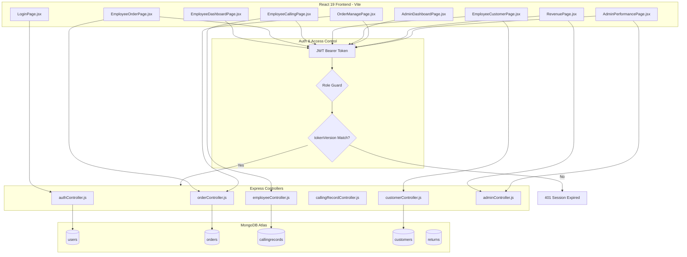

# Project Master Documentation — GatecodeXcars24

> **Document Status**: Single Source of Truth  
> **Project Name**: GatecodeXcars24  
> **Repository Root**: `r:\GatecodeXcars24` (and `r:\BPO Management\BPO Management`)  
> **Audit Date**: 2026-09-28  
> **System Classification**: Used-Car CRM & Automotive Operations Platform  

---

## 1. Project Overview

**GatecodeXcars24** is an enterprise automotive operations and customer relationship management platform built to coordinate used-car procurement, customer leads, appointment scheduling, vehicle purchases, returns, executive telecalling, and employee performance.

The solution is structured as a monorepo consisting of two primary packages:
1. `gatecodexcars24-client`: A Single Page Application (SPA) built on **React 19**, **Vite 8**, and **React Router 7**, featuring a clean SaaS light design system in official GatecodeXcars24 brand colors.
2. `gatecodexcars24-server`: A REST API built on **Node.js**, **Express 5**, and **Mongoose 9** backed by **MongoDB Atlas**, featuring JWT authentication with single-active-session concurrency enforcement and database-offline resiliency fallbacks.

The application serves two distinct user personas:
- **Administrators**: Operational managers who oversee aggregate performance, sales and revenue metrics, order statuses, dispatch tracking, returns authorization, customer directories, and employee user credential administration.
- **Employees**: Telecallers and field representatives who log daily calling activities, register customer leads, create customer orders with proof-of-payment receipts, initiate product returns, and review personal performance and calculated commission incentives.

---

## 2. Project Purpose

The platform automates workflows that are traditionally maintained in disparate spreadsheets or disconnected CRMs:
- **Lead and Call Accounting**: Records telecaller call metrics (outgoing, incoming, connected, unreached, follow-up calls, leads converted, and attributed revenue).
- **Order Booking & Payment Verification**: Captures hardware sales orders (GPS units, Vending Machines, Waste Disposal units, or custom products) along with banking channel data and physical payment screenshot slips.
- **Logistics Fulfillment**: Coordinates parcel status lifecycle (`Pending` → `Process` → `Parcel` → `Packed` → `Dispatched` → `Delivered`) along with courier partner names and consignment tracking numbers.
- **Reverse Logistics (RMA)**: Structured workflow for customer returns covering defect inspection reasons, approval states, and pickup dispatching.
- **Transparent Commissioning**: Dynamically computes employee incentives based on sales volume and tier pricing rules.
- **Executive Reporting**: Generates client-side printable PDF audit sheets for executive reviews, employee dossiers, and CRM records using `jspdf` and `jspdf-autotable`.

---

## 3. Product / Business Context

The product targets businesses delivering institutional hardware and IoT devices (such as GPS vehicle trackers and automated vending kiosks) to regional institutions (e.g., banks including SBI, BOB, BOM, MGB, UPGB, MPGB, and regional coordinators).

Business Operations Flow:
```
Telecaller Call Outreach -> Lead Identification -> Customer CRM Record ->
Order Booking + Advance Payment Upload -> Admin Verification -> Warehouse Packing & Dispatch ->
Delivery & Commission Incentive Calculation -> (Optional) Return / RMA Processing
```

Target Users:
- **BPO Telecallers / Executives**: Frontline agents creating orders, recording follow-ups, and tracking earnings.
- **Operations & Warehouse Admins**: Backoffice operators updating courier manifests and parcel milestones.
- **Finance & Executive Admins**: Supervisory staff evaluating monthly revenue trends, calling yields, and individual employee productivity.

---

## 4. Current Implementation Status

| Capability / Module | Status | Evidence / Notes |
| :--- | :--- | :--- |
| **Authentication & Session Versioning** | **IMPLEMENTED** | `authController.js`, `authMiddleware.js`, `AuthContext.jsx`. Single active session enforcement via `tokenVersion`. |
| **Offline DB Fallback (Admin Emergency Access)** | **IMPLEMENTED** | `server.js`, `db.js`, `authController.js`. Server starts if DB is down; fixed admin can log in in-memory. |
| **Order Management (Admin)** | **IMPLEMENTED** | `orderRoutes.js`, `orderController.js`, `OrderManagePage.jsx`, `OrderHistoryPage.jsx`. Full CRUD, status transitions, courier dispatch tracking. |
| **Order Creation (Employee & Admin)** | **IMPLEMENTED** | `OrderPage.jsx`, `EmployeeOrderPage.jsx`, `uploadMiddleware.js`. Multipart form with screenshot uploads and PDF exports. |
| **Return Requests (RMA)** | **IMPLEMENTED** | `returnRoutes.js`, `returnController.js`, `ReturnPage.jsx`, `EmployeeReturnPage.jsx`, `ReturnManagePage.jsx`. |
| **Telecalling Reports (Employee & Admin)** | **IMPLEMENTED** | `callingRecordRoutes.js`, `callingRecordController.js`, `CallingReportPage.jsx`, `EmployeeCallingPage.jsx`. |
| **Customer CRM Management** | **IMPLEMENTED** | `customerRoutes.js`, `customerController.js`, `CustomersPage.jsx`, `EmployeeCustomerPage.jsx`. Role-scoped data isolation. |
| **Employee Performance & Dossiers** | **IMPLEMENTED** | `adminRoutes.js`, `adminController.js`, `AdminPerformancePage.jsx`, `EmployeeDetailsPage.jsx`. Multi-table aggregation & PDF generator. |
| **Sales & Revenue Dashboards** | **IMPLEMENTED** | `adminController.js` (`getRevenueSummary`, `getSalesSummary`), `RevenuePage.jsx`, `SalesPage.jsx`. MongoDB `$facet`/aggregation by month. |
| **Product Catalog Management** | **BROKEN / PHANTOM** | `ProductsPage.jsx` invokes `POST /api/products`. **No backend route, controller, or Mongoose model exists for products!** |
| **Employee Self-Dashboard** | **IMPLEMENTED** | `employeeController.js` (`getEmployeeDashboard`), `EmployeeDashboardPage.jsx`. Includes incentive calculation engine. |
| **Audit Log / Employee Records** | **PARTIALLY IMPLEMENTED** | `EmployeeRecord.js`, `employeeRecordController.js`, `employeeRecordRoutes.js`. Backend exists; only used in migration scripts (`fixadmin.js`); no dedicated admin UI screen. |
| **Realtime Updates (WebSockets)** | **NOT IMPLEMENTED / ABSENT** | No WebSocket/Socket.IO implementation in code. Frontend relies on polling (`setInterval` in `AdminDashboardPage.jsx`). |
| **Automated Test Suite** | **NOT IMPLEMENTED / ABSENT** | Zero unit/integration tests (`npm test` does not exist). Only manual test scripts in `server/src/scripts/`. |
| **Legacy / Unreachable Pages** | **DEAD CODE** | `PublicDashboardPage.jsx`, `CloneDashboardPage.jsx`, `MainDashboardPage.jsx`, `SimpleTest.jsx` are not reachable via `App.jsx`. |

---

## 5. Technology Stack

### Monorepo & Infrastructure
- **Package Manager**: npm workspaces (`package.json` root workspace managing `client` and `server`)
- **Orchestration Tool**: `concurrently` (^9.2.1) for simultaneous local frontend and backend booting
- **Deployment Targets**: Render (Web Service for Node.js API), Vercel (Static Web Client with rewrite rules)

### Frontend Layer (`dashboard-client`)
- **Core Library**: React 19 (`react` ^19.2.6, `react-dom` ^19.2.6)
- **Bundler & Dev Server**: Vite 8 (`vite` ^8.0.14, `@vitejs/plugin-react` ^6.0.2)
- **Client Routing**: React Router DOM 7 (`react-router-dom` ^7.15.1)
- **HTTP Client**: Axios (`axios` ^1.16.1) with global authorization bearer interceptor and 401 redirector
- **Document Generation**: jsPDF (`jspdf` ^4.2.1) + jsPDF AutoTable (`jspdf-autotable` ^5.0.8)
- **Styling**: Pure Vanilla CSS (`client/src/styles/index.css`, 2,488 lines) with glassmorphism, responsive grid layouts, custom SVG charts, and dark theme design tokens

### Backend Layer (`dashboard-server`)
- **Runtime Environment**: Node.js (ES Modules, `"type": "module"`)
- **Web Application Framework**: Express 5 (`express` ^5.2.1)
- **Database Driver / ODM**: Mongoose (`mongoose` ^9.6.3)
- **Authentication**: JSON Web Tokens (`jsonwebtoken` ^9.0.3) + Password Hashing (`bcryptjs` ^3.0.3)
- **Validation**: Express-Validator (`express-validator` ^7.3.2)
- **File Upload Handler**: Multer (`multer` ^2.0.2) storing to disk storage
- **HTTP Request Logger**: Morgan (`morgan` ^1.10.1)
- **CORS Handler**: CORS (`cors` ^2.8.6)
- **Environment Management**: Dotenv (`dotenv` ^17.4.2)
- **Process Supervisor**: Nodemon (`nodemon` ^3.1.14) for development auto-restarts

### Database Layer
- **Database Technology**: MongoDB 6+ hosted on MongoDB Atlas
- **Network / DNS Handling**: Node.js `node:dns/promises` explicit server assignment to Cloudflare DNS (`1.1.1.1`) to resolve Atlas SRV records under restrictive network environments

---

## 6. System Architecture

### High-Level Architecture Diagram



---

## 7. Repository / Folder Structure

```
r:\BPO Management\BPO Management/
├── .gitignore                          # Standard git exclusion rules
├── package.json                        # Root monorepo workspace configuration
├── package-lock.json                   # Dependency lockfile
├── README.md                           # Operational documentation & quickstart
├── database_migration_guide.md         # Database backup and mongorestore runbook
├── render.yaml                         # Infrastructure-as-code for Render backend deploy
│
├── client/                             # React 19 Frontend Workspace
│   ├── .env.example                    # Client environment template (VITE_API_BASE_URL)
│   ├── index.html                      # HTML document entry point
│   ├── package.json                    # Client dependencies and build scripts
│   ├── package-lock.json               # Client dependency tree lock
│   ├── test_verify.pdf                 # Artifact verifying jsPDF compilation
│   ├── vercel.json                     # Vercel SPA routing rewrite rules
│   ├── vite.config.js                  # Vite server & reverse-proxy configuration
│   └── src/
│       ├── main.jsx                    # React entrypoint with ErrorBoundary
│       ├── App.jsx                     # Route declaration and layout hierarchy
│       ├── api/
│       │   └── client.js               # Axios instance with auth interceptors & URL helpers
│       ├── components/
│       │   ├── DashboardLayout.jsx     # Admin app shell with sidebar and top navbar
│       │   ├── DataTable.jsx           # Generic table with search, sorting, modal & pagination
│       │   ├── EditModal.jsx           # Modal dialog for record modification
│       │   ├── EmployeeLayout.jsx      # Employee app shell
│       │   ├── EmployeeSidebar.jsx     # Employee navigation menu
│       │   ├── EmployeeTopNavbar.jsx   # Employee top navbar with date badge
│       │   ├── Field.jsx               # Form field wrapper with error rendering
│       │   ├── ProtectedRoute.jsx      # Authentication and role authorization gatekeeper
│       │   ├── Sidebar.jsx             # Admin sidebar with collapsible menus & logout
│       │   ├── SummaryCard.jsx         # KPI summary card component
│       │   ├── Toast.jsx               # Auto-dismissing floating alert banner
│       │   └── TopNavbar.jsx           # Admin top navbar with hamburger button
│       ├── context/
│       │   ├── AuthContext.jsx         # React Context providing session token & user payload
│       │   └── SidebarContext.jsx      # Mobile drawer state context provider
│       ├── pages/
│       │   ├── AdminDashboardPage.jsx  # Primary executive dashboard with SVG analytics
│       │   ├── AdminPerformancePage.jsx# Aggregated employee output comparison
│       │   ├── CallingReportPage.jsx   # Master telecalling table with date filtering & PDF export
│       │   ├── CloneDashboardPage.jsx  # [ORPHANED] Unrouted prototype dashboard
│       │   ├── CustomersPage.jsx       # Customer directory with Order history vs CRM tabs
│       │   ├── EmployeeCallingPage.jsx # Telecaller call logging form and personal logs
│       │   ├── EmployeeCustomerPage.jsx# Telecaller lead creation and follow-up tracker
│       │   ├── EmployeeDashboardPage.jsx# Telecaller personal KPI and incentive counter
│       │   ├── EmployeeDetailsPage.jsx # Deep-dive dossier per employee with unified PDF export
│       │   ├── EmployeeOrderPage.jsx   # Telecaller order entry, payment proof & personal orders
│       │   ├── EmployeeReturnPage.jsx  # Telecaller return submission and status view
│       │   ├── LoginPage.jsx           # Unified login form for Admin and Employee roles
│       │   ├── MainDashboardPage.jsx   # [ORPHANED] Single-line redirect component
│       │   ├── OrderHistoryPage.jsx    # Complete historical order archive
│       │   ├── OrderManagePage.jsx     # Order review, parcel status editing & courier assignment
│       │   ├── OrderPage.jsx           # Admin-level direct order placement form
│       │   ├── ProductsPage.jsx        # Product creation form (Broken: backend route missing)
│       │   ├── PublicDashboardPage.jsx # [ORPHANED] Legacy unauthenticated landing page
│       │   ├── RegisterPage.jsx        # Admin user creation and employee editing screen
│       │   ├── ReturnHistoryPage.jsx   # Complete historical return archive
│       │   ├── ReturnManagePage.jsx    # Return status transition and deletion console
│       │   ├── ReturnPage.jsx          # Admin-level direct return submission
│       │   ├── RevenuePage.jsx         # Monthly/Daily/Weekly financial revenue breakdown
│       │   ├── SalesPage.jsx           # Monthly/Daily/Weekly order volume breakdown
│       │   ├── SimpleTest.jsx          # [ORPHANED] Diagnostic JSX verification component
│       │   └── UsersPage.jsx           # User management table with editing and deletion
│       ├── styles/
│       │   └── index.css               # Central stylesheet (glassmorphism tokens, utilities)
│       └── utils/
│           └── validators.js           # Regex helpers for Indian mobile numbers and pincodes
│
└── server/                             # Express 5 Backend Workspace
    ├── .env                            # Active environment configuration
    ├── .env.example                    # Backend environment variable template
    ├── package.json                    # Backend dependencies and startup scripts
    ├── package-lock.json               # Backend dependency lockfile
    ├── uploads/                        # Local disk directory for payment screenshots
    └── src/
        ├── app.js                      # Express application instantiation and route mounts
        ├── server.js                   # Node entrypoint with DB connection & admin seeding
        ├── config/
        │   ├── db.js                   # Mongoose connection logic, DNS set, readiness check
        │   └── seedAdmin.js            # Auto-upsert of default administrative user
        ├── controllers/
        │   ├── adminController.js      # Analytics, sales summaries, and employee dossiers
        │   ├── authController.js       # Login, logout, session versioning, user CRUD
        │   ├── callingRecordController.js # Admin calling record management
        │   ├── customerController.js   # Customer lead management with role-based scoping
        │   ├── dashboardController.js  # High-level counters (orders, returns)
        │   ├── employeeController.js   # Employee dashboard, orders, returns, calls, incentives
        │   ├── employeeRecordController.js # Internal activity audit records
        │   ├── orderController.js      # Order CRUD, status updates, parcel updates
        │   └── returnController.js     # Return requests CRUD and status workflow
        ├── middleware/
        │   ├── authMiddleware.js       # JWT validation, single-device check, adminOnly guard
        │   ├── errorMiddleware.js      # Global 404 and unhandled exception formatters
        │   ├── subdomainMiddleware.js  # [DEAD] Deprecated placeholder
        │   ├── uploadMiddleware.js     # Multer file storage, 2MB size filter, PNG/JPG check
        │   └── validateMiddleware.js   # Express-validator error collector
        ├── models/
        │   ├── CallingRecord.js        # Calling log schema with virtual totalCallsDone
        │   ├── Customer.js             # Customer lead schema with followUp enum
        │   ├── EmployeeRecord.js       # Activity record schema
        │   ├── Order.js                # Core order schema with status enums and bank selection
        │   ├── ReturnRequest.js        # RMA schema with return reasons and statuses
        │   └── User.js                 # User credential schema with tokenVersion
        ├── routes/
        │   ├── adminRoutes.js          # /api/admin endpoints
        │   ├── authRoutes.js           # /api/auth endpoints
        │   ├── callingRecordRoutes.js  # /api/calling-records endpoints
        │   ├── customerRoutes.js       # /api/customers endpoints
        │   ├── dashboardRoutes.js      # /api/dashboard endpoints
        │   ├── employeeRecordRoutes.js # /api/employee-records endpoints
        │   ├── employeeRoutes.js       # /api/employee endpoints
        │   ├── orderRoutes.js          # /api/orders endpoints
        │   └── returnRoutes.js         # /api/returns endpoints
        ├── scripts/
        │   ├── check_screenshots.js    # Diagnostic script querying recent order screenshots
        │   ├── check_url.js            # HTTP check script testing uploaded file accessibility
        │   ├── fixadmin.js             # One-time script creating/fixing admin user in Atlas
        │   ├── migrate_direct.js       # Cross-cluster direct collection data migration script
        │   ├── migration_verify.js     # Post-migration database document counter
        │   └── test_conn.js            # Atlas connection diagnostic with custom DNS testing
        └── validators/
            ├── authValidators.js       # Rules for registration and login
            ├── orderValidators.js      # Rules for order creation and status patches
            └── returnValidators.js     # Rules for return creation and status patches
```

---

## 8. Application Entry Points

### 1. Frontend Entry Point: [`client/src/main.jsx`](file:///r:/BPO%20Management/BPO%20Management/client/src/main.jsx)
- **Bootstrap Flow**: Mounts into `#root` in `index.html`.
- **Error Boundary**: Encapsulated within a custom React `ErrorBoundary` class component (`lines 10-59`). If an uncaught rendering crash occurs, it renders a fallback recovery UI with a button: `Clear Token & Reload`, which clears `localStorage.getItem("dashboard_token")` and triggers `window.location.reload()`.
- **Router Root**: Initializes `BrowserRouter` wrapping [`App.jsx`](file:///r:/BPO%20Management/BPO%20Management/client/src/App.jsx).

### 2. Backend Entry Point: [`server/src/server.js`](file:///r:/BPO%20Management/BPO%20Management/server/src/server.js)
- **Bootstrap Flow**:
  1. Resolves `server/.env` using `dotenv.config()`.
  2. Executes `connectDB(DB_TIMEOUT)` ([`server/src/config/db.js`](file:///r:/BPO%20Management/BPO%20Management/server/src/config/db.js)).
  3. If database connects successfully, executes `ensureFixedAdminUser()` ([`server/src/config/seedAdmin.js`](file:///r:/BPO%20Management/BPO%20Management/server/src/config/seedAdmin.js)).
  4. **Resiliency Catch**: If MongoDB connection times out or fails (e.g., DNS error, Atlas offline), it catches the error, logs `"MongoDB unavailable. Starting API without database"`, and proceeds to start the Express listener.
  5. Starts HTTP server on `process.env.PORT || 5000`.

---

## 9. Frontend Architecture

### Framework and Router
- **React 19.2.6** utilizing functional components and hooks (`useState`, `useEffect`, `useCallback`, `useMemo`).
- **React Router DOM 7.15.1** managing a split routing structure:
  - Root path `/` evaluates user status in `<RootRedirect />` and directs to `/login`, `/admin/dashboard`, or `/employee/dashboard`.
  - Admin paths wrapped by `<AdminLayout />` which enforces `<ProtectedRoute role="admin">`.
  - Employee paths wrapped by `<EmployeeOnlyLayout />` which enforces `<ProtectedRoute role="employee">`.

### Layout and State Hierarchy
- **Authentication State**: Global singleton context [`AuthContext.jsx`](file:///r:/BPO%20Management/BPO%20Management/client/src/context/AuthContext.jsx) reads `dashboard_token` from `localStorage`, decodes the payload, and evaluates token expiration (`payload.exp * 1000 < Date.now()`).
- **Navigation State**: [`SidebarContext.jsx`](file:///r:/BPO%20Management/BPO%20Management/client/src/context/SidebarContext.jsx) manages mobile hamburger drawer toggling. Automatically triggers `closeSidebar()` upon location changes in both `DashboardLayout` and `EmployeeLayout`.
- **Page-Level State**: Each page independently manages its form inputs, table filters, search queries, pagination, and modal dialog visibility.

### Design System and Styling Architecture
- **Vanilla CSS Tokens**: Defined in `:root` inside [`client/src/styles/index.css`](file:///r:/BPO%20Management/BPO%20Management/client/src/styles/index.css):
  - Primary Accent: `--primary: #06b6d4;` (Cyan)
  - Backgrounds: Deep Slate `--bg: #0f172a;`, Cards `--bg-card: #1a2540;`, Sidebar `--bg-sidebar: #0d1527;`
  - Status Accents: `--success: #10b981;`, `--warning: #f59e0b;`, `--danger: #ef4444;`
- **Glassmorphism**: `.glass-card` uses subtle borders (`1px solid var(--border)`), backdrop blurs, and layered box shadows (`--shadow-lg`).
- **Data Table Component**: [`DataTable.jsx`](file:///r:/BPO%20Management/BPO%20Management/client/src/components/DataTable.jsx) encapsulates client-side prefix-matching search across specified keys, multi-column alphanumeric sorting, fixed page-size slicing (12 items per page), and detailed view modal generation.

---

## 10. Backend Architecture

### Request Lifecycle
```
Incoming Request -> cors() -> express.json() -> morgan("dev") -> Static /uploads
                -> Route Match -> authMiddleware (protect)
                -> authMiddleware (adminOnly) [If Admin Route]
                -> uploadMiddleware (Multer) [If Multipart Upload]
                -> express-validator Rules
                -> validateMiddleware (Checks errors)
                -> Controller Method -> Mongoose Model Query -> JSON Response
```

### Modular Layering
1. **Routing Layer** (`server/src/routes/`): Pure endpoint declarations mapping HTTP verbs and URIs to chains of middleware and controllers.
2. **Validation Layer** (`server/src/validators/`): Declarative array of `express-validator` rules (`body()`, `matches()`, `isIn()`, `isFloat()`).
3. **Controller Layer** (`server/src/controllers/`): Business logic, database queries, and response formatting. All asynchronous code is wrapped in `try/catch` delegating to `next(error)`.
4. **Data Access Layer** (`server/src/models/`): Mongoose schemas declaring types, required constraints, default timestamps, and compound indexes.
5. **Error Handling Layer** (`server/src/middleware/errorMiddleware.js`): Global catch-all middleware transforming uncaught errors into clean JSON payloads with stack traces hidden in production.

---

## 11. Database Architecture

- **Engine**: MongoDB with Mongoose ODM
- **Connection Configuration**: [`server/src/config/db.js`](file:///r:/BPO%20Management/BPO%20Management/server/src/config/db.js)
  - DNS Server Injection: `dns.setServers(['1.1.1.1'])` overrides host DNS configuration to guarantee MongoDB SRV lookup reliability.
  - Connection Pool / Timeouts: `serverSelectionTimeoutMS: 5000`, `connectTimeoutMS: 5000`.
  - Database Name Sanitization: `sanitizeMongoUri()` parses URIs and replaces whitespace in database names with underscores.

### Database Relationship Diagram (ERD)



---

## 12. Database Schema

### Collection: `users` ([`server/src/models/User.js`](file:///r:/BPO%20Management/BPO%20Management/server/src/models/User.js))
| Field | Type | Attributes | Description |
| :--- | :--- | :--- | :--- |
| `_id` | ObjectId | Primary Key, Auto | Unique document identifier |
| `name` | String | Required, Trim | Full name of administrator or employee |
| `email` | String | Required, Unique, Lowercase, Trim | Login email identifier |
| `password` | String | Required | bcrypt salted hash (rounds: 10) |
| `phoneNumber` | String | Optional, Trim | Contact phone number |
| `username` | String | Optional, Unique, Sparse, Trim | Optional unique username slug |
| `role` | String | Enum: `["admin", "user", "employee"]`, Default: `"user"` | Authorization group |
| `tokenVersion`| Number | Default: `0` | Timestamp/epoch of active token; enforces single active session |
| `createdAt` | Date | Auto Timestamp | Record creation timestamp |
| `updatedAt` | Date | Auto Timestamp | Record modification timestamp |

### Collection: `orders` ([`server/src/models/Order.js`](file:///r:/BPO%20Management/BPO%20Management/server/src/models/Order.js))
| Field | Type | Attributes | Description |
| :--- | :--- | :--- | :--- |
| `_id` | ObjectId | Primary Key, Auto | Unique order identifier |
| `employeeId` | ObjectId | Ref: `User`, Default: `null` | Associated booking user ID |
| `employeeName` | String | Default: `""` | Name of booking agent at time of order |
| `customerName` | String | Required, Trim | Name of customer/lead purchasing hardware |
| `mobileNumber` | String | Required, Trim | 10-digit mobile number |
| `alternateMobileNumber`| String | Default: `""`, Trim | Alternate contact number |
| `fullAddress` | String | Required, Trim | Shipping/installation physical address |
| `pincode` | String | Required, Trim | 6-digit Indian postal code |
| `productType` | String | Required, Enum: `["GPS", "Vending Machine", "Disposal", "Other"]` | Hardware classification |
| `customProductName` | String | Default: `""` | Required if productType is `"Other"` |
| `numberOfUnits` | Number | Required, Min: 1 | Quantity ordered |
| `amount` | Number | Required, Min: 0 | Unit price in INR |
| `totalAmount` | Number | Required, Min: 0 | Computed: `numberOfUnits * amount` |
| `advanceAmount` | Number | Required, Min: 0 | Advance paid (must be <= `totalAmount`) |
| `paymentScreenshot` | String | Default: `""` | Relative path to upload (e.g. `/uploads/1781...jpg`) |
| `dateOfOrder` | Date | Default: `Date.now` | User-specified order booking date |
| `orderStatus` | String | Enum: `["Pending", "Approved", "Processing", "Delivered", "Cancelled"]`, Default: `"Pending"` | Administrative processing status |
| `parcelStatus` | String | Enum: `["Pending", "Process", "Parcel", "Packed", "Dispatched", "Delivered"]`, Default: `"Pending"` | Warehouse shipping pipeline status |
| `trackingId` | String | Default: `""` | Consignment tracking barcode / AWB |
| `courierCompany`| String | Default: `""` | Logistics carrier (e.g., DTDC, Delhivery) |
| `bankName` | String | Enum: `["SBI", "BOB", "BOM", "MGB", "UPGB", "MPGB"]`, Default: `""` | Bank receiving payment |
| `createdAt` | Date | Auto Timestamp | Order creation timestamp |
| `updatedAt` | Date | Auto Timestamp | Order update timestamp |

### Collection: `returns` (`returnrequests`) ([`server/src/models/ReturnRequest.js`](file:///r:/BPO%20Management/BPO%20Management/server/src/models/ReturnRequest.js))
| Field | Type | Attributes | Description |
| :--- | :--- | :--- | :--- |
| `_id` | ObjectId | Primary Key, Auto | Unique return identifier |
| `employeeId` | ObjectId | Ref: `User`, Default: `null` | Associated representative ID |
| `employeeName` | String | Default: `""` | Representative name |
| `customerName` | String | Required, Trim | Customer returning device |
| `mobileNumber` | String | Required, Trim | Customer contact number |
| `pincode` | String | Required, Trim | 6-digit postal code |
| `productType` | String | Required, Enum: `["GPS", "Vending Machine", "Disposal", "Other"]` | Product returning |
| `numberOfUnitsReturning` | Number | Required, Min: 1 | Quantity returning |
| `returnReason` | String | Required, Enum: `["Product Damaged", "Wrong Product", "Product Not Working", "Extra Order", "Other"]` | Primary defect/return driver |
| `customReason` | String | Default: `""` | Required if reason is `"Other"` |
| `additionalDescription`| String | Default: `""` | Free-text commentary |
| `returnDate` | Date | Default: `Date.now` | Initiation date |
| `returnStatus` | String | Enum: `["Return Requested", "Return Approved", "Pickup Scheduled", "Returned Successfully", "Return Rejected"]`, Default: `"Return Requested"` | Lifecycle workflow state |
| `createdAt` | Date | Auto Timestamp | Record creation timestamp |
| `updatedAt` | Date | Auto Timestamp | Record update timestamp |

### Collection: `customers` ([`server/src/models/Customer.js`](file:///r:/BPO%20Management/BPO%20Management/server/src/models/Customer.js))
| Field | Type | Attributes | Description |
| :--- | :--- | :--- | :--- |
| `_id` | ObjectId | Primary Key, Auto | Unique customer identifier |
| `employeeId` | ObjectId | Ref: `User`, Required | Agent owning the customer lead |
| `employeeName` | String | Required | Agent name |
| `customerName` | String | Required, Trim, Match: `/^[a-zA-Z\s]+$/` | Name (alpha-space only) |
| `mobile` | String | Required, Trim, Match: `/^\d{10}$/` | Exact 10-digit mobile |
| `email` | String | Optional, Trim, Default: `""` | Contact email |
| `remark` | String | Optional, Trim, Default: `""` | Agent notes |
| `district` | String | Optional, Trim, Match: `/^[a-zA-Z\s]*$/` | Geographic district |
| `state` | String | Optional, Trim, Match: `/^[a-zA-Z\s]*$/` | Geographic state |
| `distCordinate`| String | Enum: `["", "CSP Incharge", "DC", "SH", "NH"]` | Banking coordination tier |
| `followUp` | String | Enum: `["Convert", "Converted"]`, Default: `"Convert"` | Lead status |
| `createdAt` | Date | Auto Timestamp | Creation timestamp |
| `updatedAt` | Date | Auto Timestamp | Modification timestamp |
- **Indexes**: Compound index `{ employeeId: 1, createdAt: -1 }`.

### Collection: `callingrecords` ([`server/src/models/CallingRecord.js`](file:///r:/BPO%20Management/BPO%20Management/server/src/models/CallingRecord.js))
| Field | Type | Attributes | Description |
| :--- | :--- | :--- | :--- |
| `_id` | ObjectId | Primary Key, Auto | Unique calling record ID |
| `employeeId` | ObjectId | Ref: `User`, Required | Associated telecaller ID |
| `employeeName` | String | Required | Telecaller name |
| `date` | Date | Required | Shift / logging date |
| `outgoingCalls` | Number | Default: `0` | Outgoing call volume |
| `incomingCalls` | Number | Default: `0` | Inbound call volume |
| `connectedCalls`| Number | Default: `0` | Successful connections |
| `notConnectedCalls` | Number | Default: `0` | Unanswered / unreachable |
| `interestedLeads`| Number | Default: `0` | Positive interest leads |
| `notInterestedLeads` | Number | Default: `0` | Disqualified / no interest |
| `followUpCalls` | Number | Default: `0` | Follow-up phone calls made |
| `followUpLeads` | Number | Default: `0` | Follow-up opportunities |
| `conversionsDone`| Number | Default: `0` | Orders booked / converted |
| `revenueGenerated`| Number | Default: `0` | Revenue attributed to call conversions |
| `createdBy` | ObjectId | Ref: `User`, Default: `null` | Authoring user ID |
| `totalCallsDone` | Number | **Virtual** | Evaluated: `outgoingCalls + incomingCalls + followUpCalls` |
- **Indexes**: Compound index `{ employeeId: 1, date: -1 }`.

### Collection: `employeerecords` ([`server/src/models/EmployeeRecord.js`](file:///r:/BPO%20Management/BPO%20Management/server/src/models/EmployeeRecord.js))
| Field | Type | Attributes | Description |
| :--- | :--- | :--- | :--- |
| `_id` | ObjectId | Primary Key, Auto | Unique audit log ID |
| `employeeId` | ObjectId | Ref: `User`, Required | Target employee ID |
| `employeeName` | String | Required | Target employee name |
| `date` | Date | Required | Event date |
| `type` | String | Enum: `["order", "return", "other"]`, Default: `"other"` | Event category |
| `description` | String | Default: `""` | Event log summary |
| `referenceId` | ObjectId | Default: `null` | Foreign ID to Order or Return |
| `createdBy` | ObjectId | Ref: `User`, Default: `null` | Admin creating the entry |
- **Indexes**: Compound index `{ employeeId: 1, date: -1 }`.

---

## 13. API Architecture

- **Protocol**: HTTP/1.1 REST over JSON (and `multipart/form-data` for file uploads)
- **Base URL**: `/api` (configured client-side via `VITE_API_BASE_URL`)
- **Authentication Scheme**: HTTP Authorization Header with `Bearer <JWT_TOKEN>`
- **Response Format**:
  - Success: `{ message?: string, data?: any }`
  - Error: `{ message: string, errors?: Array<{ field: string, message: string }> }`
- **Status Codes Used**:
  - `200 OK`: Successful read or update operation
  - `201 Created`: Successful creation of order, return, record, user, customer
  - `400 Bad Request`: Validation failure or business rule violation (e.g. advance > total)
  - `401 Unauthorized`: Token missing, invalid, or expired due to another device login
  - `403 Forbidden`: Admin role required, role mismatch, or updating another agent's customer
  - `404 Not Found`: Resource ID not found in database
  - `409 Conflict`: Duplicate email or username during registration
  - `503 Service Unavailable`: MongoDB offline fallback (blocks writes and employee actions)

---

## 14. Complete API Inventory

### Auth Module ([`server/src/routes/authRoutes.js`](file:///r:/BPO%20Management/BPO%20Management/server/src/routes/authRoutes.js))
| Method | Endpoint | Auth | Role | Validation | Description |
| :--- | :--- | :--- | :--- | :--- | :--- |
| `POST` | `/api/auth/login` | None | Public | Email valid, password required | Authenticates user; enforces single session |
| `POST` | `/api/auth/logout` | Bearer | Any | None | Sets user `tokenVersion` to `0` |
| `POST` | `/api/auth/register` | Bearer | Admin | Name, Email, Password(>=6), Mobile, Username | Creates new user/employee |
| `GET` | `/api/auth/users` | Bearer | Admin | None | Returns list of all users excluding password |
| `GET` | `/api/auth/users/:id` | Bearer | Admin | None | Retrieves user details by ID |
| `PUT` | `/api/auth/users/:id` | Bearer | Admin | None | Updates user details, email, or password |
| `DELETE`| `/api/auth/users/:id` | Bearer | Admin | None | Deletes user from database |

### Order Module ([`server/src/routes/orderRoutes.js`](file:///r:/BPO%20Management/BPO%20Management/server/src/routes/orderRoutes.js))
| Method | Endpoint | Auth | Role | Validation | Description |
| :--- | :--- | :--- | :--- | :--- | :--- |
| `POST` | `/api/orders` | Bearer | Any | `createOrderValidator` + Multer | Creates order with optional payment proof |
| `GET` | `/api/orders` | Bearer | Admin | None | Returns all orders sorted descending by date |
| `PUT` | `/api/orders/:id` | Bearer | Admin | None | Updates order details |
| `PATCH`| `/api/orders/:id/status` | Bearer | Admin | `updateOrderStatusValidator` | Modifies `orderStatus` |
| `PATCH`| `/api/orders/:id/parcel-status` | Bearer | Admin | `updateParcelStatusValidator` | Modifies `parcelStatus`, trackingId, courier |
| `DELETE`| `/api/orders/:id` | Bearer | Admin | None | Deletes order document |

### Return Module ([`server/src/routes/returnRoutes.js`](file:///r:/BPO%20Management/BPO%20Management/server/src/routes/returnRoutes.js))
| Method | Endpoint | Auth | Role | Validation | Description |
| :--- | :--- | :--- | :--- | :--- | :--- |
| `POST` | `/api/returns` | Bearer | Any | `createReturnRequestValidator` | Submits new product return request |
| `GET` | `/api/returns` | Bearer | Admin | None | Lists all return requests |
| `PUT` | `/api/returns/:id` | Bearer | Admin | None | Updates return details |
| `PATCH`| `/api/returns/:id/status` | Bearer | Admin | `updateReturnStatusValidator` | Modifies `returnStatus` |
| `DELETE`| `/api/returns/:id` | Bearer | Admin | None | Deletes return request |

### Employee Portal Module ([`server/src/routes/employeeRoutes.js`](file:///r:/BPO%20Management/BPO%20Management/server/src/routes/employeeRoutes.js))
| Method | Endpoint | Auth | Role | Scoping | Description |
| :--- | :--- | :--- | :--- | :--- | :--- |
| `GET` | `/api/employee/dashboard` | Bearer | Any | `req.user._id` | Returns KPI counters and calculated incentive |
| `GET` | `/api/employee/orders` | Bearer | Any | `req.user._id` | Lists orders placed by this employee |
| `GET` | `/api/employee/returns` | Bearer | Any | `req.user._id` | Lists returns initiated by this employee |
| `PUT` | `/api/employee/orders/:id` | Bearer | Any | `req.user._id` | Updates own order details |
| `DELETE`| `/api/employee/orders/:id` | Bearer | Any | `req.user._id` | Deletes own order |
| `PUT` | `/api/employee/returns/:id` | Bearer | Any | `req.user._id` | Updates own return details |
| `DELETE`| `/api/employee/returns/:id` | Bearer | Any | `req.user._id` | Deletes own return |
| `GET` | `/api/employee/calling-records` | Bearer | Any | `req.user._id` | Lists own telecalling entries with date filter |
| `POST` | `/api/employee/calling-records` | Bearer | Any | `req.user._id` | Submits own daily telecalling record |
| `PUT` | `/api/employee/calling-records/:id` | Bearer | Any | `req.user._id` | Updates own telecalling record |
| `DELETE`| `/api/employee/calling-records/:id`| Bearer | Any | `req.user._id` | Deletes own telecalling record |

### Admin Analytics Module ([`server/src/routes/adminRoutes.js`](file:///r:/BPO%20Management/BPO%20Management/server/src/routes/adminRoutes.js))
| Method | Endpoint | Auth | Role | Parameters | Description |
| :--- | :--- | :--- | :--- | :--- | :--- |
| `GET` | `/api/admin/revenue-summary` | Bearer | Admin | `month`, `year` | Aggregates daily, weekly, monthly gross revenue |
| `GET` | `/api/admin/sales-summary` | Bearer | Admin | `month`, `year` | Aggregates order volumes, units, and amounts |
| `GET` | `/api/admin/employee-performance` | Bearer | Admin | `filter`, `startDate`, `endDate` | Returns orders & returns count per employee |
| `GET` | `/api/admin/employee-history` | Bearer | Admin | `employeeId`, `startDate`, `endDate` | Returns orders and returns for single employee |
| `GET` | `/api/admin/employee-summary` | Bearer | Admin | `startDate`, `endDate` | Performance table: sales, revenue, orders |
| `GET` | `/api/admin/employee-details/:id` | Bearer | Admin | `startDate`, `endDate` | Comprehensive dossier (orders, returns, calls, leads) |

### Customer CRM Module ([`server/src/routes/customerRoutes.js`](file:///r:/BPO%20Management/BPO%20Management/server/src/routes/customerRoutes.js))
| Method | Endpoint | Auth | Role | Scoping | Description |
| :--- | :--- | :--- | :--- | :--- | :--- |
| `GET` | `/api/customers` | Bearer | Any | Role Scoped | Employees get own leads; Admins get all/filtered |
| `POST` | `/api/customers` | Bearer | Any | `req.user._id` | Creates new customer lead |
| `PUT` | `/api/customers/:id` | Bearer | Any | Owner Check | Updates customer lead (Employees restricted to own) |
| `DELETE`| `/api/customers/:id` | Bearer | Any | Owner Check | Deletes customer lead (Employees restricted to own) |

### Telecalling Admin Module ([`server/src/routes/callingRecordRoutes.js`](file:///r:/BPO%20Management/BPO%20Management/server/src/routes/callingRecordRoutes.js))
| Method | Endpoint | Auth | Role | Description |
| :--- | :--- | :--- | :--- | :--- |
| `GET` | `/api/calling-records` | Bearer | Admin | Retrieves calling records across all employees with date filtering |
| `POST` | `/api/calling-records` | Bearer | Admin | Creates calling record on behalf of an employee |
| `DELETE`| `/api/calling-records/:id` | Bearer | Admin | Deletes calling record document |

### Internal Audit Module ([`server/src/routes/employeeRecordRoutes.js`](file:///r:/BPO%20Management/BPO%20Management/server/src/routes/employeeRecordRoutes.js))
| Method | Endpoint | Auth | Role | Description |
| :--- | :--- | :--- | :--- | :--- |
| `GET` | `/api/employee-records` | Bearer | Admin | Retrieves audit activity logs |
| `POST` | `/api/employee-records` | Bearer | Admin | Creates audit activity log entry |
| `DELETE`| `/api/employee-records/:id` | Bearer | Admin | Removes audit activity log entry |

### Dashboard & System Health Module
| Method | Endpoint | Auth | Role | Description |
| :--- | :--- | :--- | :--- | :--- |
| `GET` | `/api/health` | None | Public | Returns `{ message: "API running" }` |
| `GET` | `/api/dashboard/summary` | Bearer | Admin | Returns `{ totalOrders, pendingOrders, deliveredOrders, totalReturns }` |
| `GET` | `/uploads/*` | None | Public | Serves static file or returns SVG 404 placeholder |

---

## 15. Authentication

### Authentication Lifecycle Diagram



### Detailed Token & Session Mechanics
1. **JWT Secret & Expiration**: Configured via `process.env.JWT_SECRET` with expiration default `1d` (`process.env.JWT_EXPIRES_IN`).
2. **Single-Device Concurrency Control**:
   - Every login generates `const newTokenVersion = Date.now()` which is saved into `User.tokenVersion` in the database.
   - The token payload stores this `tokenVersion`.
   - On every authenticated API request, [`authMiddleware.js`](file:///r:/BPO%20Management/BPO%20Management/server/src/middleware/authMiddleware.js) (`line 45`) compares `decoded.tokenVersion` against `user.tokenVersion`.
   - If a user logs in on a second device or browser tab, the database `tokenVersion` increments, instantly invalidating the first session with a `401 Unauthorized: Session expired. You have been logged out from another device.`
3. **Password Security**: Passwords hashed with `bcryptjs` using 10 salt rounds. Minimum length of 6 characters enforced by `authValidators.js`.
4. **Auto-Seeded Fixed Admin**:
   - [`server/src/config/seedAdmin.js`](file:///r:/BPO%20Management/BPO%20Management/server/src/config/seedAdmin.js) ensures an admin account (`sales@rmaxiot.in` / `rmax@2026`) is created or updated in the database on server startup.
   - Admin registration endpoint is strictly restricted (`adminOnly` middleware on `POST /api/auth/register`).

---

## 16. Authorization / RBAC / ACL

The system implements a 3-tier role architecture (`admin`, `employee`, `user`):

```
Role: "admin"
  └── Full system access: Users, Orders, Returns, Logistics, Pricing, Dossiers, CRM.
Role: "employee"
  └── Scoped operational access:
        ├── Can only view own orders (`employeeId === req.user._id`)
        ├── Can only view own returns (`employeeId === req.user._id`)
        ├── Can only view and edit own customers (`customer.employeeId === req.user._id`)
        ├── Can only view and create own telecalling records
        └── Blocked from admin routes (HTTP 403 Forbidden)
Role: "user"
  └── Default role in User model schema; in practice, accounts created by admin default to "employee".
```

### Enforcement Points
1. **Server Middleware**:
   - `protect`: Validates JWT signature, checks `tokenVersion`, and binds `req.user`.
   - `adminOnly`: Re-verifies that `decoded.role === "admin"` or `user.email === ADMIN_EMAIL`. Rejects unauthorized roles with `403 Forbidden: Admin access required.`
2. **Client Route Guards**:
   - [`ProtectedRoute.jsx`](file:///r:/BPO%20Management/BPO%20Management/client/src/components/ProtectedRoute.jsx) checks `user.role === role`.
   - If an employee navigates to `/admin/*`, `ProtectedRoute` intercepts and redirects them to `/employee/dashboard`.
   - If an unauthenticated guest attempts navigation, redirects to `/login`.

---

## 17. Multi-Tenancy

- **Status**: **SINGLE-TENANT ARCHITECTURE** (Confirmed)
- **Investigation & Finding**:
  - The file [`server/src/middleware/subdomainMiddleware.js`](file:///r:/BPO%20Management/BPO%20Management/server/src/middleware/subdomainMiddleware.js) contains the note: `// subdomainMiddleware removed — centralized login replaces subdomain-based auth`.
  - No database models contain `tenantId`, `organizationId`, or `companyId`.
  - All users, orders, and records exist within a single monolithic MongoDB database.
  - Multi-tenancy is not active in this codebase.

---

## 18. Realtime / Socket Architecture

- **Status**: **NOT IMPLEMENTED / ABSENT** (Confirmed)
- **Investigation & Finding**:
  - No `socket.io`, `ws`, or native WebSocket server instances exist in `server/package.json` or `server/src/`.
  - Frontend relies on client-side interval polling. For example, [`AdminDashboardPage.jsx`](file:///r:/BPO%20Management/BPO%20Management/client/src/pages/AdminDashboardPage.jsx#L468-L471) sets:
    ```javascript
    useEffect(() => {
      const interval = setInterval(load, 30000);
      return () => clearInterval(interval);
    }, [load]);
    ```
    Every 30 seconds, the admin dashboard fetches `/api/dashboard/summary`, `/api/orders`, and `/api/returns`.

---

## 19. Notifications

- **Status**: Client-Side Toast Notifications Only.
- **Implementation**: [`client/src/components/Toast.jsx`](file:///r:/BPO%20Management/BPO%20Management/client/src/components/Toast.jsx). Displays a floating card at top-right with auto-dismiss timer (3,000 milliseconds).
- **Email / SMS / Push Notifications**: **NOT IMPLEMENTED**. No integration with SendGrid, Nodemailer, Twilio, Firebase Cloud Messaging, or AWS SNS exists.

---

## 20. File / Media Handling

### Upload Pipeline
1. **Trigger**: Employee or Admin attaches a payment screenshot (`.jpg`, `.jpeg`, `.png`) when booking an order.
2. **Client Validation**: Checked in `OrderPage.jsx` and `EmployeeOrderPage.jsx`:
   - Allowed MIME types: `image/jpeg`, `image/jpg`, `image/png`.
   - Max file size: `2 * 1024 * 1024` bytes (2 MB).
   - Generates local blob preview via `URL.createObjectURL(file)`.
3. **Transport**: Transmitted via `multipart/form-data` with key `paymentScreenshot`.
4. **Server Storage**: Handled by [`server/src/middleware/uploadMiddleware.js`](file:///r:/BPO%20Management/BPO%20Management/server/src/middleware/uploadMiddleware.js):
   - Storage destination: Local directory `server/uploads/`.
   - Filename convention: `${Date.now()}-${file.originalname.replace(/\s+/g, "_")}`.
   - Multer file size limit: 2MB.
5. **Static File Serving**:
   - `app.use("/uploads", express.static(path.join(__dirname, "../uploads")))` serves raw files.
   - **404 SVG Fallback**: If an image cannot be located on disk (common in ephemeral cloud containers), Express returns an inline SVG badge displaying `"Screenshot Not Found"` ([`server/src/app.js`](file:///r:/BPO%20Management/BPO%20Management/server/src/app.js#L25-L33)).
   - Client Helper: `toAbsoluteAssetUrl()` in `client/src/api/client.js` prepends `API_ORIGIN` to relative paths like `/uploads/...`.

---

## 21. External Integrations

| Service / Provider | Purpose | Status | Implementation Details |
| :--- | :--- | :--- | :--- |
| **MongoDB Atlas** | Primary Cloud Database | **ACTIVE** | Configured via `MONGO_URI`. Uses Cloudflare DNS override (`1.1.1.1`). |
| **Render** | Backend Cloud Hosting | **ACTIVE** | Defined in `render.yaml`. Auto-builds from root dir `server`. |
| **Vercel** | Frontend Cloud Hosting | **ACTIVE** | Configured via `vercel.json` SPA rewrite rules. |
| **Payment Gateways** | Online payment collection | **NOT INTEGRATED** | Manual bank transfer / UPI screenshots used instead. |
| **SMS / WhatsApp Gateway** | Telephony / SMS alerts | **NOT INTEGRATED** | Manual phone logging only. |
| **Courier APIs** | Live AWB consignment tracking | **NOT INTEGRATED** | Tracking IDs and carrier names entered as static text strings. |

---

## 22. Environment Variables

### Backend Environment Variables (`server/.env`)
| Variable Name | Required | Default / Fallback | Purpose | Classification |
| :--- | :--- | :--- | :--- | :--- |
| `PORT` | Optional | `5000` | Port for Express HTTP listener | Configuration |
| `MONGO_URI` | **Required** | None | MongoDB Atlas connection string | **Secret / Credential** (`<REDACTED>`) |
| `JWT_SECRET` | **Required** | None | Cryptographic secret for signing tokens | **Secret** (`<REDACTED>`) |
| `JWT_EXPIRES_IN` | Optional | `1d` | Token expiration duration | Configuration |
| `ADMIN_EMAIL` | Optional | `sales@rmaxiot.in` | Auto-seeded admin user email | Credential (`<REDACTED>`) |
| `ADMIN_PASSWORD` | Optional | `rmax@2026` | Auto-seeded admin user password | **Secret** (`<REDACTED>`) |
| `ADMIN_NAME` | Optional | `RMAX Admin` | Display name of auto-seeded admin | Configuration |
| `DB_TIMEOUT_MS` | Optional | `10000` | Milliseconds to wait for DB connection | Configuration |

### Frontend Environment Variables (`client/.env`)
| Variable Name | Required | Default / Fallback | Purpose |
| :--- | :--- | :--- | :--- |
| `VITE_API_BASE_URL`| Optional | `/api` | Base path for API requests (proxy or remote URL) |

---

## 23. Configuration

- **Vite Configuration** ([`client/vite.config.js`](file:///r:/BPO%20Management/BPO%20Management/client/vite.config.js)):
  - Host binding: `0.0.0.0` (accessible over LAN)
  - Port: `5173`
  - Proxy Rules: Maps `/api` and `/uploads` directly to `http://localhost:5000`.
- **Vercel Routing** ([`client/vercel.json`](file:///r:/BPO%20Management/BPO%20Management/client/vercel.json)):
  - Rewrite all routes `/(.*)` to `/index.html` to permit HTML5 client-side pushState navigation.
- **Render Deployment** ([`render.yaml`](file:///r:/BPO%20Management/BPO%20Management/render.yaml)):
  - Type: Web Service, Node runtime, free tier, root directory `server`.

---

## 24. Complete Feature Inventory

| Module | Feature Name | Frontend Route | Backend Endpoint | Status | Description |
| :--- | :--- | :--- | :--- | :--- | :--- |
| **Auth** | Centralized Sign In | `/login`, `/admin/login` | `POST /api/auth/login` | **IMPLEMENTED** | Role-segmented authentication |
| **Auth** | Session Logout | Sidebar Button | `POST /api/auth/logout` | **IMPLEMENTED** | Clears token and invalidates version |
| **Auth** | User Registration | `/admin/register` | `POST /api/auth/register` | **IMPLEMENTED** | Admin creates employee credentials |
| **Auth** | User Management | `/admin/users` | `GET,PUT,DELETE /api/auth/users` | **IMPLEMENTED** | Modifies names, emails, passwords |
| **Orders** | Admin Order Creation | `/admin/orders` | `POST /api/orders` | **IMPLEMENTED** | Creates order with screenshot |
| **Orders** | Employee Order Entry | `/employee/orders` | `POST /api/orders` | **IMPLEMENTED** | Creates employee-attributed order |
| **Orders** | Order Management | `/admin/orders/manage` | `GET,PUT,DELETE /api/orders` | **IMPLEMENTED** | Changes status, tracks parcels |
| **Orders** | Order History | `/admin/orders/history` | `GET /api/orders` | **IMPLEMENTED** | Historical archive with date picker |
| **Orders** | PDF Export | Button in UI | Client-side jsPDF | **IMPLEMENTED** | Download structured order table |
| **Returns** | Return Request | `/admin/returns`, `/employee/returns` | `POST /api/returns` | **IMPLEMENTED** | Submits RMA ticket with reason |
| **Returns** | Return Management | `/admin/returns/manage` | `GET,PUT,DELETE /api/returns` | **IMPLEMENTED** | Manages RMA status lifecycle |
| **Returns** | Return History | `/admin/returns/history` | `GET /api/returns` | **IMPLEMENTED** | Archive of returned inventory |
| **Telecalling**| Call Logging | `/employee/calling-report` | `POST /api/employee/calling-records` | **IMPLEMENTED** | Logs shift call statistics |
| **Telecalling**| Calling Reports | `/admin/calling-report` | `GET /api/calling-records` | **IMPLEMENTED** | Master report with totals row |
| **CRM** | Customer Directory | `/admin/customers`, `/employee/customers`| `GET,POST,PUT,DELETE /api/customers` | **IMPLEMENTED** | Lead management with follow-up tag |
| **Analytics**| Executive Dashboard | `/admin/dashboard` | `GET /api/dashboard/summary` | **IMPLEMENTED** | KPI cards & SVG trend visuals |
| **Analytics**| Sales Overview | `/admin/sales` | `GET /api/admin/sales-summary` | **IMPLEMENTED** | Monthly order & unit counts |
| **Analytics**| Revenue Breakdown | `/admin/revenue` | `GET /api/admin/revenue-summary` | **IMPLEMENTED** | Monthly gross sales + call revenue |
| **Analytics**| Employee Performance | `/admin/performance` | `GET /api/admin/employee-performance`| **IMPLEMENTED** | Productivity comparison |
| **Analytics**| Employee Dossier | `/admin/employee-details` | `GET /api/admin/employee-details/:id`| **IMPLEMENTED** | Comprehensive employee audit PDF |
| **Products** | Product Catalog | `/admin/products` | `POST /api/products` | **BROKEN / PHANTOM** | Endpoint does not exist in backend |

---

## 25. Complete Screen / Page Inventory

### Admin Screens (Rendered inside `<DashboardLayout />`)
1. **`AdminDashboardPage`** (`/admin/dashboard`):
   - Components: Summary Cards, `OrdersOverviewChart` (SVG), `BarChart` (SVG), `DoughnutChart` (SVG), Top Products, Top Customers, Low Stock list.
   - APIs: `/api/dashboard/summary`, `/api/orders`, `/api/returns`.
2. **`OrderPage`** (`/admin/orders`):
   - Components: Order entry form, bank selector, file upload dropzone, live total & commission preview.
   - APIs: `POST /api/orders`.
3. **`OrderManagePage`** (`/admin/orders/manage`):
   - Components: `DataTable`, `EditModal`, status pills, parcel pills, PDF export button.
   - APIs: `GET /api/orders`, `PUT /api/orders/:id`, `PATCH /api/orders/:id/parcel-status`, `DELETE /api/orders/:id`.
4. **`OrderHistoryPage`** (`/admin/orders/history`):
   - Components: `DataTable` with date picker filter.
   - APIs: `GET /api/orders`.
5. **`ReturnPage`** (`/admin/returns`):
   - Components: Return creation form with conditional custom reason field.
   - APIs: `POST /api/returns`.
6. **`ReturnManagePage`** (`/admin/returns/manage`):
   - Components: `DataTable`, `EditModal` for return status lifecycle, PDF export button.
   - APIs: `GET /api/returns`, `PUT /api/returns/:id`, `PATCH /api/returns/:id/status`, `DELETE /api/returns/:id`.
7. **`ReturnHistoryPage`** (`/admin/returns/history`):
   - Components: `DataTable` archive of completed/rejected returns.
   - APIs: `GET /api/returns`.
8. **`CustomersPage`** (`/admin/customers`):
   - Components: Dual-tab view: Tab 1 "Orders" aggregates unique buyers from order history; Tab 2 "CRM" lists direct leads with district, state, and PDF export.
   - APIs: `GET /api/orders`, `GET /api/customers`.
9. **`ProductsPage`** (`/admin/products`):
   - Components: New product creation form (Name, SKU, Price, Stock).
   - APIs: `POST /api/products` (Fails with 404).
10. **`RevenuePage`** (`/admin/revenue`):
    - Components: Month/Year navigation picker, Daily/Weekly/Monthly revenue cards, revenue comparison charts.
    - APIs: `GET /api/admin/revenue-summary`.
11. **`SalesPage`** (`/admin/sales`):
    - Components: Month/Year picker, Total revenue, Unit count, Order count.
    - APIs: `GET /api/admin/sales-summary`.
12. **`AdminPerformancePage`** (`/admin/performance`):
    - Components: Filter pills (`Today`, `Yesterday`, `Week`, `Month`, `Custom`), summary cards per employee.
    - APIs: `GET /api/admin/employee-performance`.
13. **`EmployeeDetailsPage`** (`/admin/employee-details`):
    - Components: Employee selector dropdown, unified summary metrics, tabular orders, returns, and calls with deep jsPDF report generator.
    - APIs: `GET /api/admin/employee-details/:id`.
14. **`CallingReportPage`** (`/admin/calling-report`):
    - Components: Master calling table, total summaries row, landscape PDF generator.
    - APIs: `GET /api/calling-records`.
15. **`UsersPage`** (`/admin/users`):
    - Components: Searchable user directory, role badges, delete action, modal preview.
    - APIs: `GET /api/auth/users`, `DELETE /api/auth/users/:id`.
16. **`RegisterPage`** (`/admin/register`, `/admin/register/:id`):
    - Components: Create or update form for user accounts.
    - APIs: `POST /api/auth/register`, `PUT /api/auth/users/:id`.

### Employee Screens (Rendered inside `<EmployeeLayout />`)
17. **`EmployeeDashboardPage`** (`/employee/dashboard`):
    - Components: Personal KPI cards (Total Orders, Total Returns, Calculated Incentive Commission), filter bar.
    - APIs: `GET /api/employee/dashboard`.
18. **`EmployeeOrderPage`** (`/employee/orders`):
    - Components: Collapsible order form, payment screenshot upload, personal orders list, PDF report download, edit/delete modals.
    - APIs: `POST /api/orders`, `GET /api/employee/orders`, `PUT /api/employee/orders/:id`, `DELETE /api/employee/orders/:id`.
19. **`EmployeeReturnPage`** (`/employee/returns`):
    - Components: Return creation form, personal returns list, PDF report download, edit/delete modals.
    - APIs: `POST /api/returns`, `GET /api/employee/returns`, `PUT /api/employee/returns/:id`, `DELETE /api/employee/returns/:id`.
20. **`EmployeeCallingPage`** (`/employee/calling-report`):
    - Components: Shift telecalling log form, daily history table, landscape PDF export.
    - APIs: `GET,POST,PUT,DELETE /api/employee/calling-records`.
21. **`EmployeeCustomerPage`** (`/employee/customers`):
    - Components: Customer lead creation form, CRM directory, follow-up status toggle (`Convert` / `Converted`).
    - APIs: `GET,POST,PUT,DELETE /api/customers`.

### Authentication Screen
22. **`LoginPage`** (`/login`, `/admin/login`, `/login/admin`):
    - Components: Centered glass card, role-sensitive header (`Admin Sign In` vs `Employee Sign In`), password submission.

### Orphaned / Unrouted Screens
23. **`CloneDashboardPage`**: Prototype dashboard with action cards. Not imported in `App.jsx`.
24. **`MainDashboardPage`**: Single-line redirect to `/admin/dashboard`. Not imported in `App.jsx`.
25. **`PublicDashboardPage`**: Legacy unauthenticated public order/return form (591 lines). Not imported in `App.jsx`.
26. **`SimpleTest`**: Diagnostic JSX verification component. Not imported in `App.jsx`.

---

## 26. Navigation Architecture

```
/ (Root) ──> Evaluates AuthContext
             ├── If Unauthenticated ──> /login
             ├── If Role == "employee" ──> /employee/dashboard
             └── If Role == "admin" ──> /admin/dashboard

/login, /admin/login ──> Authenticates & routes to respective dashboard

/admin/* (Protected by <AdminLayout />)
├── /admin/dashboard
├── /admin/revenue
├── /admin/sales
├── /admin/users
├── /admin/register (and /admin/register/:id)
├── /admin/orders ──> Collapsible Submenu ──> [/admin/orders/manage, /admin/orders/history]
├── /admin/returns ──> Collapsible Submenu ──> [/admin/returns/manage, /admin/returns/history]
├── /admin/performance
├── /admin/calling-report
├── /admin/employee-details
├── /admin/customers
└── /admin/products

/employee/* (Protected by <EmployeeOnlyLayout />)
├── /employee/dashboard
├── /employee/orders
├── /employee/returns
├── /employee/calling-report
└── /employee/customers
```

---

## 27. State Management

- **Global Session State**: Handled by React Context [`AuthContext.jsx`](file:///r:/BPO%20Management/BPO%20Management/client/src/context/AuthContext.jsx). Stores:
  - `user`: Object `{ id, name, email, role }` decoded from JWT.
  - `loading`: Boolean indicating initial check of `localStorage`.
  - Methods: `login(email, password, role)` and `logout()`.
- **Drawer State**: [`SidebarContext.jsx`](file:///r:/BPO%20Management/BPO%20Management/client/src/context/SidebarContext.jsx). Provides `sidebarOpen`, `toggleSidebar()`, and `closeSidebar()`.
- **Local Component State**: Standard React `useState` hooks for form fields, active modal IDs, search strings, sort configurations, and data arrays.

---

## 28. Data Fetching & Caching

- **HTTP Client**: Configured Axios instance in [`client/src/api/client.js`](file:///r:/BPO%20Management/BPO%20Management/client/src/api/client.js).
- **Request Interceptor**: Extracts `dashboard_token` from `localStorage` and appends `Authorization: Bearer <token>`.
- **Response Interceptor**: Intercepts HTTP 401 and 403 errors, removes `dashboard_token` from `localStorage`, and triggers `window.location.href = "/login"` if not currently on a login page.
- **Caching**: **NO caching layer** (No React Query, SWR, or RTK Query). Every page change or filter click dispatches a live HTTP request to the backend.

---

## 29. Important Business Workflows

### Workflow 1: Order Booking & Commission Flow


### Workflow 2: Parcel Fulfillment Lifecycle


### Workflow 3: Customer Return (RMA) Workflow


---

## 30. Business Rules

### 1. Commission / Incentive Formula
Enforced in [`server/src/controllers/employeeController.js`](file:///r:/BPO%20Management/BPO%20Management/server/src/controllers/employeeController.js#L91-L96) and client preview calculators:
- If unit `amount <= 3200 INR`:
  $$\text{Incentive} = \text{amount} \times 0.0225 \times \text{numberOfUnits} \quad (2.25\% \text{ commission})$$
- If unit `amount > 3200 INR`:
  $$\text{Incentive} = (\text{amount} - 3200) \times \text{numberOfUnits} \quad (100\% \text{ of excess over 3200 INR})$$

### 2. Order Payment Validation
- `advanceAmount` cannot exceed `totalAmount` (`numberOfUnits * amount`). Enforced in both frontend validation and backend Mongoose/express-validator checks.

### 3. Banking Institutions
- Orders must be associated with an authorized bank: `["SBI", "BOB", "BOM", "MGB", "UPGB", "MPGB"]`.

### 4. Product Types
- Hardware types: `["GPS", "Vending Machine", "Disposal", "Other"]`.
- If `"Other"` is chosen, `customProductName` is mandatory.

### 5. Return Reasons
- Permitted return reasons: `["Product Damaged", "Wrong Product", "Product Not Working", "Extra Order", "Other"]`.
- If `"Other"` is chosen, `customReason` is mandatory.

### 6. Single Session Enforcement
- Each user account has a single valid session. Logging into a new device updates `tokenVersion` and revokes previously issued tokens immediately upon their next API interaction.

---

## 31. Constants & Configurable Values

| Constant Name | Current Value | Locations in Code | Recommended Direction |
| :--- | :--- | :--- | :--- |
| **Commission Baseline Price** | `3200` INR | `employeeController.js:91`, `PublicDashboardPage.jsx:61`, `OrderPage.jsx:46` | Move to database settings collection |
| **Commission Percentage** | `0.0225` (2.25%) | `employeeController.js:92`, `PublicDashboardPage.jsx:61`, `OrderPage.jsx:46` | Move to database settings collection |
| **Allowed Banks** | `["SBI", "BOB", "BOM", "MGB", "UPGB", "MPGB"]` | `Order.js:38`, `orderValidators.js:6`, `OrderManagePage.jsx:79` | Centralize in a shared constants file |
| **Allowed Hardware Products** | `["GPS", "Vending Machine", "Disposal", "Other"]` | `Order.js:14`, `ReturnRequest.js:12`, `orderValidators.js:3` | Move to dynamic Products DB table |
| **Max Image Upload Size** | `2 * 1024 * 1024` (2MB) | `uploadMiddleware.js:34`, `OrderPage.jsx:25`, `EmployeeOrderPage.jsx:28` | Environment variable `MAX_UPLOAD_SIZE_MB` |
| **DNS Server Override** | `['1.1.1.1']` | `db.js:4`, `fixadmin.js:5`, `test_conn.js:22` | Configurable via `DNS_SERVER` env |
| **Page Size for Data Tables** | `12` | `DataTable.jsx:63` | Configurable per user table preference |

---

## 32. Background Jobs / Cron / Queues

- **Status**: **NOT IMPLEMENTED / ABSENT** (Confirmed)
- **Investigation & Finding**:
  - No job queuing engines (Bull, BullMQ, Agenda, BeeQueue, RabbitMQ, SQS) are present.
  - No background cron schedulers (`node-cron`, `agenda`, `cron`) are installed or configured.
  - All aggregation queries run synchronously during HTTP GET requests.

---

## 33. Search / Filtering / Pagination

### Search Implementation
- **Client-Side Search**: [`client/src/components/DataTable.jsx`](file:///r:/BPO%20Management/BPO%20Management/client/src/components/DataTable.jsx#L72-L80) performs prefix matching using `val.startsWith(q)` across specified keys (e.g. `customerName`, `mobileNumber`, `trackingId`).
- **Server-Side Search**: Not implemented on backend; endpoints return whole collection arrays and rely on the client to filter and slice.

### Filtering Implementation
- **Date Range Filters**: Admin and Employee dashboards support filter presets (`today`, `yesterday`, `week`, `month`, `custom`) passed as query params (`?filter=week` or `?startDate=YYYY-MM-DD&endDate=YYYY-MM-DD`). Backend parses timestamps and constructs Mongoose query filters `{ createdAt: { $gte: start, $lte: end } }`.

### Pagination Implementation
- Client-side pagination slices the filtered array: `filtered.slice((page - 1) * pageSize, page * pageSize)`. Fixed at 12 rows per page.

---

## 34. Error Handling

### Backend Error Architecture
- **Global 404 Handler**: [`server/src/middleware/errorMiddleware.js`](file:///r:/BPO%20Management/BPO%20Management/server/src/middleware/errorMiddleware.js) routes unmatched paths to `notFound` which triggers an HTTP 404 error: `Route not found: <URL>`.
- **Global Exception Handler**: `errorHandler` captures uncaught errors, sets status code to 500 (or existing error status), and outputs clean JSON: `{ message, stack }`. `stack` is hidden when `process.env.NODE_ENV === "production"`.

### Frontend Error Architecture
- **React Error Boundary**: [`client/src/main.jsx`](file:///r:/BPO%20Management/BPO%20Management/client/src/main.jsx#L10-L59) catches component rendering errors and displays a recovery banner with a token reset button.
- **Axios Global Interceptor**: Intercepts 401/403 HTTP responses and automatically flushes `localStorage.removeItem("dashboard_token")` and redirects to `/login`.

---

## 35. Logging & Monitoring

- **HTTP Request Logging**: Configured via `morgan("dev")` in `server/src/app.js`. Logs method, path, HTTP status, and response latency to `stdout`.
- **Debug File Logging**: [`server/src/middleware/authMiddleware.js`](file:///r:/BPO%20Management/BPO%20Management/server/src/middleware/authMiddleware.js#L6-L9) appends JWT role verification logs to `server/debug.log`.
- **Monitoring Tools**: No external APM (Datadog, Sentry, New Relic) is integrated. Relies on standard Render console output.

---

## 36. Security Architecture

1. **Authentication Security**:
   - bcrypt 10-round salted password hashes.
   - JWT tokens signed using HMAC SHA-256 with server-side secret.
   - Single-active-session revocation using `tokenVersion`.
2. **Authorization Security**:
   - Strict role-based guard middleware on backend (`protect` and `adminOnly`).
   - Customer leads isolated by `employeeId`.
3. **File Upload Security**:
   - Multer whitelist strictly restricted to `image/jpeg`, `image/jpg`, and `image/png`.
   - File size ceiling capped at 2MB.
   - Original filename sanitized (`file.originalname.replace(/\s+/g, "_")`) to prevent directory traversal.
4. **Identified Security Risks**:
   - CORS is configured as open `app.use(cors())` with no origin whitelist restriction.
   - Rate limiting middleware (e.g. `express-rate-limit`) is absent; authentication endpoints are vulnerable to brute-force credential stuffing.
   - Static files in `/uploads` are served publicly without requiring authentication.

---

## 37. Performance Architecture

- **Database Indexes**: Compound index on `Customer` (`{ employeeId: 1, createdAt: -1 }`), `CallingRecord` (`{ employeeId: 1, date: -1 }`), and `EmployeeRecord` (`{ employeeId: 1, date: -1 }`).
- **Aggregation Pipelines**: Sales and Revenue endpoints use MongoDB native `$group` and `$sum` aggregation pipelines rather than loading entire datasets into memory.
- **Identified Bottlenecks**:
  - `GET /api/orders` and `GET /api/returns` return complete unpaginated collections. As order volumes scale into tens of thousands, server memory consumption and JSON serialization latency will increase. Server-side pagination (`skip`/`limit`) should be introduced.

---

## 38. Offline Architecture

- **Backend Offline Resiliency**:
  - If MongoDB Atlas is unavailable or unreachable on startup, [`server/src/server.js`](file:///r:/BPO%20Management/BPO%20Management/server/src/server.js) allows the Express server to boot.
  - The fallback administrator credentials (`sales@rmaxiot.in` / `rmax@2026`) allow the administrator to authenticate in-memory and receive a valid JWT.
  - Any database query in controllers checks `isDatabaseReady()` and safely returns `503 Service Unavailable` rather than crashing the Node process.
- **Frontend Offline State**:
  - Progressive Web App (PWA) service workers are not installed. The client cannot function without internet access.

---

## 39. Testing Architecture

- **Status**: **ZERO AUTOMATED TESTS** (Confirmed)
- **Investigation & Finding**:
  - `server/package.json` and `client/package.json` do not contain test scripts or test runners (Jest, Mocha, Vitest, Playwright, Cypress).
  - Diagnostic scripts exist for manual verification:
    - [`server/src/scripts/test_conn.js`](file:///r:/BPO%20Management/BPO%20Management/server/src/scripts/test_conn.js): Validates Atlas DNS resolution.
    - [`server/src/scripts/migration_verify.js`](file:///r:/BPO%20Management/BPO%20Management/server/src/scripts/migration_verify.js): Verifies collection document counts.
    - [`server/src/scripts/check_screenshots.js`](file:///r:/BPO%20Management/BPO%20Management/server/src/scripts/check_screenshots.js): Inspects payment screenshot URIs on recent orders.

---

## 40. Deployment Architecture



- **Backend**: Render web service. Builds via `npm install` and starts via `node src/server.js`.
- **Frontend**: Vercel. Static build created via `npm run build` (`vite build`).

---

## 41. Development Setup

### Prerequisites
- Node.js 18+ (tested on Node 20 / 22)
- npm 9+
- Active MongoDB connection string

### Step-by-Step Local Initialization
1. **Clone & Install**:
   ```bash
   cd "r:\BPO Management\BPO Management"
   npm install
   ```
2. **Configure Backend Environment**:
   Create `server/.env`:
   ```env
   PORT=5000
   MONGO_URI=mongodb+srv://<user>:<password>@cluster0.xxxxx.mongodb.net/bpo-management
   JWT_SECRET=development_secret_key_12345
   JWT_EXPIRES_IN=1d
   ADMIN_EMAIL=sales@rmaxiot.in
   ADMIN_PASSWORD=rmax@2026
   ADMIN_NAME=RMAX Admin
   ```
3. **Configure Frontend Environment**:
   Create `client/.env`:
   ```env
   VITE_API_BASE_URL=/api
   ```
4. **Boot Both Systems Concurrently**:
   ```bash
   npm run dev
   ```
   - Client starts at: `http://localhost:5173`
   - Server starts at: `http://localhost:5000`

---

## 42. Production Setup

1. **MongoDB Atlas**:
   - Whitelist all outbound IPs (`0.0.0.0/0`) or specific hosting egress IPs.
   - Create a dedicated user with `readWrite` privileges.
2. **Render Backend**:
   - Create Web Service pointing to `server` root directory.
   - Configure environment variables: `MONGO_URI`, `JWT_SECRET`, `ADMIN_EMAIL`, `ADMIN_PASSWORD`.
3. **Vercel Frontend**:
   - Set Root Directory to `client`.
   - Set Build Command to `npm run build` and Output Directory to `dist`.
   - Set environment variable: `VITE_API_BASE_URL=https://<your-render-server>.onrender.com/api`.

---

## 43. Third-Party Dependencies

### Backend Dependencies (`server/package.json`)
- `express` (^5.2.1): Core web application server framework.
- `mongoose` (^9.6.3): MongoDB Object-Document Mapper.
- `jsonwebtoken` (^9.0.3): Generation and verification of Bearer tokens.
- `bcryptjs` (^3.0.3): Salted password hashing algorithm.
- `multer` (^2.0.2): Multipart form-data handling for payment slips.
- `express-validator` (^7.3.2): Declarative input sanitization and validation.
- `cors` (^2.8.6): Cross-Origin Resource Sharing enablement.
- `morgan` (^1.10.1): HTTP access logging.
- `dotenv` (^17.4.2): Environment variable injector.
- `semver` (^7.6.3): Version string evaluation.
- `nodemon` (^3.1.14 - dev): File watcher for hot-reloading server code.

### Frontend Dependencies (`client/package.json`)
- `react` (^19.2.6) & `react-dom` (^19.2.6): Modern React framework.
- `react-router-dom` (^7.15.1): Declarative client-side routing.
- `axios` (^1.16.1): Promise-based HTTP client.
- `jspdf` (^4.2.1): PDF creation engine.
- `jspdf-autotable` (^5.0.8): Tabular layout generator for jsPDF.
- `vite` (^8.0.14 - dev): Next-generation ES module bundler.
- `@vitejs/plugin-react` (^6.0.2 - dev): React fast-refresh plugin.

---

## 44. Module Ownership Map

| Functional Domain | Frontend Files | Backend Routes & Controllers | Models & Database |
| :--- | :--- | :--- | :--- |
| **Authentication & Users** | `LoginPage.jsx`, `UsersPage.jsx`, `RegisterPage.jsx`, `AuthContext.jsx` | `authRoutes.js`, `authController.js`, `authValidators.js` | `User.js` (`users`) |
| **Orders & Fulfillment** | `OrderPage.jsx`, `OrderManagePage.jsx`, `OrderHistoryPage.jsx`, `EmployeeOrderPage.jsx` | `orderRoutes.js`, `orderController.js`, `orderValidators.js` | `Order.js` (`orders`) |
| **Returns & RMA** | `ReturnPage.jsx`, `ReturnManagePage.jsx`, `ReturnHistoryPage.jsx`, `EmployeeReturnPage.jsx` | `returnRoutes.js`, `returnController.js`, `returnValidators.js` | `ReturnRequest.js` (`returns`) |
| **Telecalling Operations**| `CallingReportPage.jsx`, `EmployeeCallingPage.jsx` | `callingRecordRoutes.js`, `callingRecordController.js` | `CallingRecord.js` (`callingrecords`) |
| **Customer CRM** | `CustomersPage.jsx`, `EmployeeCustomerPage.jsx` | `customerRoutes.js`, `customerController.js` | `Customer.js` (`customers`) |
| **Executive Analytics** | `AdminDashboardPage.jsx`, `RevenuePage.jsx`, `SalesPage.jsx`, `AdminPerformancePage.jsx`, `EmployeeDetailsPage.jsx` | `adminRoutes.js`, `adminController.js`, `dashboardRoutes.js`, `dashboardController.js` | All Collections Aggregated |
| **Employee Self-Portal** | `EmployeeDashboardPage.jsx`, `EmployeeLayout.jsx`, `EmployeeSidebar.jsx` | `employeeRoutes.js`, `employeeController.js` | `Order.js`, `ReturnRequest.js`, `CallingRecord.js` |
| **Products** | `ProductsPage.jsx` | **None (Missing Backend)** | **None (Missing Model)** |

---

## 45. File / Code Location Map

| Symbol / Class / Function | Physical Source File | Responsibility |
| :--- | :--- | :--- |
| `start()` | [`server/src/server.js:16`](file:///r:/BPO%20Management/BPO%20Management/server/src/server.js#L16) | Bootstraps database, seeds admin, starts listener |
| `connectDB()` | [`server/src/config/db.js:20`](file:///r:/BPO%20Management/BPO%20Management/server/src/config/db.js#L20) | Mongoose connection with Cloudflare DNS override |
| `ensureFixedAdminUser()` | [`server/src/config/seedAdmin.js:8`](file:///r:/BPO%20Management/BPO%20Management/server/src/config/seedAdmin.js#L8) | Upserts default admin account |
| `protect()` | [`server/src/middleware/authMiddleware.js:26`](file:///r:/BPO%20Management/BPO%20Management/server/src/middleware/authMiddleware.js#L26) | Enforces JWT presence & `tokenVersion` validity |
| `adminOnly()` | [`server/src/middleware/authMiddleware.js:69`](file:///r:/BPO%20Management/BPO%20Management/server/src/middleware/authMiddleware.js#L69) | Restricts route execution to admin role |
| `uploadPaymentScreenshot` | [`server/src/middleware/uploadMiddleware.js:31`](file:///r:/BPO%20Management/BPO%20Management/server/src/middleware/uploadMiddleware.js#L31) | Multer 2MB disk storage upload middleware |
| `validateRequest()` | [`server/src/middleware/validateMiddleware.js:3`](file:///r:/BPO%20Management/BPO%20Management/server/src/middleware/validateMiddleware.js#L3) | Halts request if express-validator reports errors |
| `loginAdmin()` | [`server/src/controllers/authController.js:159`](file:///r:/BPO%20Management/BPO%20Management/server/src/controllers/authController.js#L159) | Verifies credentials, increments `tokenVersion` |
| `createOrder()` | [`server/src/controllers/orderController.js:4`](file:///r:/BPO%20Management/BPO%20Management/server/src/controllers/orderController.js#L4) | Validates advance and inserts Order document |
| `getEmployeeDashboard()` | [`server/src/controllers/employeeController.js:67`](file:///r:/BPO%20Management/BPO%20Management/server/src/controllers/employeeController.js#L67) | Evaluates commissions & employee summary stats |
| `getRevenueSummary()` | [`server/src/controllers/adminController.js:182`](file:///r:/BPO%20Management/BPO%20Management/server/src/controllers/adminController.js#L182) | Aggregates daily, weekly, monthly revenue |
| `getSalesSummary()` | [`server/src/controllers/adminController.js:310`](file:///r:/BPO%20Management/BPO%20Management/server/src/controllers/adminController.js#L310) | Aggregates order units and gross sales amounts |
| `AuthProvider` | [`client/src/context/AuthContext.jsx:30`](file:///r:/BPO%20Management/BPO%20Management/client/src/context/AuthContext.jsx#L30) | Decodes JWT, manages user session in React |
| `DataTable` | [`client/src/components/DataTable.jsx:56`](file:///r:/BPO%20Management/BPO%20Management/client/src/components/DataTable.jsx#L56) | Reusable table with search, sort, paging & details modal |
| `downloadOrdersPDF()` | [`client/src/pages/EmployeeOrderPage.jsx:38`](file:///r:/BPO%20Management/BPO%20Management/client/src/pages/EmployeeOrderPage.jsx#L38) | Exports structured orders report to PDF |
| `downloadCallingPDF()` | [`client/src/pages/CallingReportPage.jsx:22`](file:///r:/BPO%20Management/BPO%20Management/client/src/pages/CallingReportPage.jsx#L22) | Exports landscape telecalling report to PDF |

---

## 46. Known Technical Debt

| Location | Description | Evidence | Impact | Recommended Direction |
| :--- | :--- | :--- | :--- | :--- |
| [`client/src/pages/ProductsPage.jsx:60`](file:///r:/BPO%20Management/BPO%20Management/client/src/pages/ProductsPage.jsx#L60) | **Missing Backend Route** | Dispatches `POST /api/products`; no route or controller exists | Submitting form throws HTTP 404 | Implement `Product.js` model, controller, and route |
| [`server/src/app.js:24-33`](file:///r:/BPO%20Management/BPO%20Management/server/src/app.js#L24-L33) | **Ephemeral Local Uploads** | Files saved to local disk `server/uploads/` | Files are lost on Render server restarts/redeploys | Migrate to Cloud Storage (AWS S3, Cloudinary) |
| [`server/src/middleware/subdomainMiddleware.js`](file:///r:/BPO%20Management/BPO%20Management/server/src/middleware/subdomainMiddleware.js) | **Dead Code File** | File contains only comments | Dead artifact | Delete unused file |
| `client/src/pages/` | **Unrouted Prototype Pages** | `PublicDashboardPage`, `CloneDashboardPage`, `SimpleTest`, `MainDashboardPage` | Dead code accumulating in bundle | Remove unreferenced page components |
| [`client/src/components/TopNavbar.jsx:27`](file:///r:/BPO%20Management/BPO%20Management/client/src/components/TopNavbar.jsx#L27) | **Direct Window Location Access** | Uses `window.location.pathname` instead of `useLocation()` | Topbar title may lag on route transitions | Refactor to `useLocation()` hook |
| [`client/src/pages/AdminDashboardPage.jsx:493-500`](file:///r:/BPO%20Management/BPO%20Management/client/src/pages/AdminDashboardPage.jsx#L493-L500) | **Hardcoded Mock Values** | `lowStockProducts = [{ name: "Battery", stock: "1" }, ...]` | Dashboard shows fake stock items | Bind to real product inventory API |
| [`client/src/pages/AdminDashboardPage.jsx:424-432`](file:///r:/BPO%20Management/BPO%20Management/client/src/pages/AdminDashboardPage.jsx#L424-L432) | **Randomized Sparklines** | `Math.random()` generated in `trendData()` | Misleading performance indicators | Derive historical sparklines from database |

---

## 47. Potential Bugs / Risks

1. **Unpaginated Database Collections**:
   - `orderController.js:43` (`Order.find().sort({ createdAt: -1 })`) and `returnController.js:27` pull all documents into RAM at once. If the collection grows to 50,000+ orders, API response payloads will cause severe memory pressure and client lag.
2. **Ephemeral Image Storage on Render**:
   - Render free-tier services do not provide persistent disk volumes. Every time the server restarts or deploys a new commit, any payment slip uploaded to `server/uploads` will disappear, triggering the fallback SVG.
3. **CORS Open Access**:
   - `app.use(cors())` permits requests from any origin. If sensitive internal data is requested with valid credentials, malicious cross-origin requests could be initiated.
4. **No Rate Limiting on Login**:
   - `/api/auth/login` has no rate limiter. It can be targeted with automated brute-force attacks.

---

## 48. Incomplete / Partial Features

- **Products Module**: The frontend page [`ProductsPage.jsx`](file:///r:/BPO%20Management/BPO%20Management/client/src/pages/ProductsPage.jsx) has a complete UI for product name, SKU, category, price, and stock. However, the backend route `POST /api/products` was never created.
- **Employee Activity Audit Log**: The model [`EmployeeRecord.js`](file:///r:/BPO%20Management/BPO%20Management/server/src/models/EmployeeRecord.js) and controller [`employeeRecordController.js`](file:///r:/BPO%20Management/BPO%20Management/server/src/controllers/employeeRecordController.js) exist and have complete CRUD endpoints (`/api/employee-records`), but there is no frontend screen connected to view or create them.

---

## 49. Mock / Dummy / Fallback Data

1. **Low Stock Mock Items**: In [`AdminDashboardPage.jsx:493-500`](file:///r:/BPO%20Management/BPO%20Management/client/src/pages/AdminDashboardPage.jsx#L493-L500), hardcoded list: Battery (1), Bulb (4), Filter (2), Charger (1), Cable (3), Sensor (2).
2. **Sparkline Random Generation**: In [`AdminDashboardPage.jsx:424-432`](file:///r:/BPO%20Management/BPO%20Management/client/src/pages/AdminDashboardPage.jsx#L424-L432), sparkline arrays generated via `Math.random()`.
3. **Hardcoded Month-over-Month Percentages**: In [`AdminDashboardPage.jsx:484-489`](file:///r:/BPO%20Management/BPO%20Management/client/src/pages/AdminDashboardPage.jsx#L484-L489), strings like `"+1.5% this month"` and `"+8.2% this month"` are static text.

---

## 50. Deprecated / Legacy Code

1. **`server/src/middleware/subdomainMiddleware.js`**: Contains only a single comment noting its deprecation.
2. **`client/src/pages/PublicDashboardPage.jsx`**: 591 lines of legacy code from an earlier iteration of the app when orders and returns were submitted on a public, unauthenticated landing page. Completely bypassed by `App.jsx`.
3. **`client/src/pages/CloneDashboardPage.jsx`**: Unrouted mockup with quick action cards.
4. **`client/src/pages/MainDashboardPage.jsx`**: Unrouted redirect component.
5. **`client/src/pages/SimpleTest.jsx`**: Temporary JSX test component.

---

## 51. Important Technical Decisions

1. **DNS Resolution Override (`1.1.1.1`)**:
   - *Problem*: Node.js on certain Windows environments and regional ISPs fails to resolve DNS SRV records for MongoDB Atlas (`mongodb+srv://`).
   - *Decision*: Hardcoded `dns.setServers(['1.1.1.1'])` in `db.js` and migration scripts to force Cloudflare public DNS resolution.
2. **Graceful Degradation / Database-Offline Admin Mode**:
   - *Problem*: Cloud database connection interruptions prevented the Node API from booting entirely.
   - *Decision*: Allow Express to start even if MongoDB fails; enable in-memory authentication of the fixed admin user so administrators can troubleshoot system state.
3. **Token Versioning for Single-Device Concurrency**:
   - *Problem*: Unauthorized credential sharing among telecallers.
   - *Decision*: Add `tokenVersion` to User schema and check it on every request. Any new login invalidates old tokens without requiring Redis session stores.

---

## 52. Architecture Diagrams

### Complete System Workflow Map



---

## 53. Critical Data Flows

### Data Flow: Call Logging to Performance Aggregation
```
Telecaller enters call metrics in EmployeeCallingPage.jsx
  │
  ▼ (POST /api/employee/calling-records)
callingRecordController.js attaches req.user._id & saves to CallingRecord
  │
  ▼
MongoDB callingrecords collection
  │
  ▼ (GET /api/admin/revenue-summary OR /api/admin/employee-details/:id)
adminController.js executes aggregate:
  - sums $revenueGenerated
  - joins Order sales $totalAmount
  │
  ▼
Returns unified financial report to RevenuePage.jsx and EmployeeDetailsPage.jsx
```

---

## 54. Critical API Flows

### Request Lifecycle: Admin Parcel Dispatch Update
```
1. Admin opens OrderManagePage.jsx
2. Selects "Dispatched" in Parcel Status dropdown & enters Tracking ID / Courier
3. Dispatches PATCH /api/orders/:id/parcel-status
4. Express routes to orderRoutes.js
5. authMiddleware verifies JWT and checks decoded.role === 'admin'
6. validateMiddleware validates parcelStatus in enum
7. orderController updates Order.findByIdAndUpdate(id, { parcelStatus, trackingId, courierCompany })
8. Returns 200 OK with updated Order JSON
9. React DataTable refreshes row with new parcel status pill
```

---

## 55. Critical Realtime Flows

- **Current State**: Realtime event push is **absent**.
- **Data Synchronization Pattern**:
  - The client employs **Pull-on-Action** (immediate refetch after mutations) and **Polling-on-Interval** (e.g. 30-second refetch on `AdminDashboardPage.jsx`).

---

## 56. Developer Quick Start

```bash
# 1. Clone project and enter directory
cd "r:\BPO Management\BPO Management"

# 2. Install monorepo dependencies
npm install

# 3. Verify server environment file
# Ensure server/.env contains valid MONGO_URI and JWT_SECRET

# 4. Start full stack in development mode
npm run dev

# 5. Access portals in browser
# Client SPA: http://localhost:5173
# API Health: http://localhost:5000/api/health
```

---

## 57. Troubleshooting Guide

### 1. `MongoServerSelectionError: querySrv ENOTFOUND`
- **Cause**: Windows or local router DNS fails to resolve Atlas SRV records.
- **Remedy**: Ensure `dns.setServers(['1.1.1.1'])` is present in `server/src/config/db.js`. Verify internet connection.

### 2. `Session expired. You have been logged out from another device.`
- **Cause**: A login occurred on another browser or device using the same credentials, which bumped `tokenVersion`.
- **Remedy**: Log in again on the current browser.

### 3. Payment Screenshot Displays Gray SVG "Screenshot Not Found"
- **Cause**: Image was stored on local disk in a previous ephemeral deployment on Render and was wiped after restart.
- **Remedy**: Migrate storage to a persistent cloud object store (AWS S3, Cloudinary).

### 4. Products Submission Fails with 404
- **Cause**: `POST /api/products` is not implemented in the backend.
- **Remedy**: Create `server/src/models/Product.js`, `productController.js`, and mount `/api/products` in `app.js`.

---

## 58. Frequently Used Commands

| Action | Command | Working Directory |
| :--- | :--- | :--- |
| **Run Both (Client + Server)** | `npm run dev` | Workspace Root |
| **Run Server Only** | `npm run dev` | `server/` |
| **Run Client Only** | `npm run dev` | `client/` |
| **Build Frontend Bundle** | `npm run build` | `client/` |
| **Verify MongoDB Migration** | `node src/scripts/migration_verify.js` | `server/` |
| **Fix / Seed Admin Account** | `node src/scripts/fixadmin.js` | `server/` |
| **Test Atlas DNS & Conn** | `node src/scripts/test_conn.js` | `server/` |

---

## 59. Glossary

- **AWB**: Air Waybill — consignment tracking code issued by courier partners.
- **BPO**: Business Process Outsourcing — telecalling and outsourced order coordination.
- **Incentive**: Commission earned by sales representatives based on units sold and tier thresholds.
- **Parcel Status**: Physical logistics state (`Pending` → `Process` → `Parcel` → `Packed` → `Dispatched` → `Delivered`).
- **Order Status**: Commercial agreement state (`Pending` → `Approved` → `Processing` → `Delivered` → `Cancelled`).
- **RMA**: Return Merchandise Authorization — reverse logistics request for defective or incorrect hardware.
- **Token Version**: Epoch timestamp in user profile invalidating previously issued JWT tokens to enforce single-device active sessions.

---

## 60. Final Project Status

The **BPO Management System** is a functional full-stack solution currently powering order management, return tickets, telecalling tracking, and customer records. The architecture is clean, leveraging modern libraries (React 19, Express 5, Mongoose 9). 

Primary areas requiring attention prior to scaling:
1. Implementation of the missing `Product` backend module.
2. Migration of file uploads from ephemeral local disk storage to S3 or Cloudinary.
3. Addition of server-side pagination for orders and returns.
4. Purging of dead/unrouted legacy components.
5. Introduction of an automated test suite.

---

# Documentation Audit

- **Files inspected**: 68 files (All source files in `client/src` and `server/src`, configuration files, migration guides, scripts)
- **Major modules discovered**: 8 (Authentication, Orders, Returns, Telecalling, Customers/CRM, Employee Self-Portal, Admin Analytics, System Health)
- **APIs discovered**: 44 active endpoints + 1 phantom missing endpoint (`POST /api/products`)
- **Database models/tables discovered**: 6 Mongoose models (`User`, `Order`, `ReturnRequest`, `Customer`, `CallingRecord`, `EmployeeRecord`)
- **Screens/pages discovered**: 26 pages (16 active admin pages, 5 active employee pages, 1 auth page, 4 unrouted/orphaned pages)
- **Integrations discovered**: 4 (MongoDB Atlas, Render, Vercel, Cloudflare 1.1.1.1 DNS)
- **Realtime events discovered**: 0 (Realtime absent; client interval polling used)
- **Environment variables discovered**: 8 server-side (`PORT`, `MONGO_URI`, `JWT_SECRET`, `JWT_EXPIRES_IN`, `ADMIN_EMAIL`, `ADMIN_PASSWORD`, `ADMIN_NAME`, `DB_TIMEOUT_MS`) + 1 client-side (`VITE_API_BASE_URL`)
- **Tests discovered**: 0 automated test suites (3 diagnostic utility scripts)
- **Known incomplete features**: Products management (frontend form without backend routes); Employee audit records (backend model without frontend UI)
- **Known technical debt items**: Ephemeral local disk file uploads, unpaginated large collections, open CORS configuration, random-number sparkline generators, dead unrouted components
- **Mock/fallback data locations**: `AdminDashboardPage.jsx` lines 424-432 (sparklines) and 493-500 (low stock products)
- **Unknown areas requiring confirmation**: None. Entire codebase inspected and confirmed.
