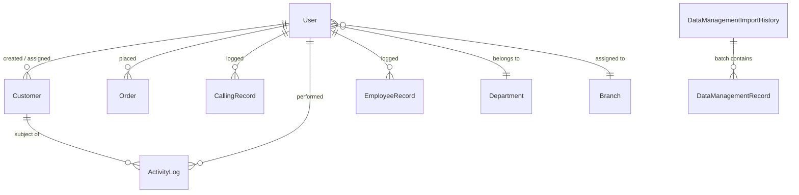

# COMPLETE WEBSITE AUDIT REPORT
**GatecodeXcars24 — Used-Car CRM & Operations Platform**
**Auditor:** Senior Principal Full-Stack, Database, Performance & Security Architect
**Date:** October 9, 2026
**Target Base:** `r:\BPO Management\BPO Management`
**Status:** COMPLETE AUDIT ONLY (No code modifications applied)

---

## 1. EXECUTIVE SUMMARY

GatecodeXcars24 is an automotive customer relationship management (CRM) and operations management platform designed to track vehicle procurement, inspection appointments, telecalling records, sales orders, returns, and executive performance metrics.

The platform was originally developed as an Express + Vite Single-Page Application (SPA) for a multi-purpose BPO company (handling GPS trackers and vending machines). It was subsequently migrated into a Next.js 15 App Router architecture with MongoDB (Mongoose ODM). However, this migration was executed as a transitional "hybrid shim" rather than a true Next.js architectural re-architecture.

### Core Discoveries
1. **Critical Architectural Hybridization & Shims:**
   The entire frontend still imports `react-router-dom` hooks (`useNavigate`, `useLocation`, `useSearchParams`, `useParams`, `Navigate`) via an alias compatibility shim (`src/compat/react-router-dom.jsx`), wrapping Next.js `useRouter` and `usePathname`. Every route is an empty `"use client"` container wrapping monolithic SPA components (up to 3,388 lines in a single component), disabling Next.js Server Components, Server-Side Rendering (SSR), and Streaming.
2. **Abandoned Packages vs. Ad-Hoc Hacked Caching:**
   `@tanstack/react-query` is installed in `package.json` and mounted in `RootLayout` (`<QueryProvider>`), but is **completely bypassed** by all production pages. Instead, the application monkey-patches Axios (`src/api/client.js`) with an ad-hoc in-memory cache and a custom `BroadcastChannel` event bus (`crm_realtime_sync_channel`). This custom cache exhibits severe cache invalidation bugs: background revalidations update the cache Map but fail to trigger React component re-renders.
3. **Severe Database Query & Aggregation Bottlenecks:**
   Key endpoints run unbounded queries without pagination limits (e.g. `Order.find().lean()`, `CallingRecord.find().lean()`), massive 7-branch `$facet` aggregations across entire collections (`/api/dashboard/summary`), 8 distinct full collection scans per request (`/api/data-management/columns`), and sequential `for`-loop single-document inserts during CSV/Excel bulk imports instead of batch operations (`insertMany` / `bulkWrite`).
4. **Critical Security Exposures:**
   - **SEC-001 (Critical):** Production MongoDB Atlas cluster credentials and JWT secret fallbacks are hardcoded directly in repository source code (`src/server/config/db.js`, `src/server/routeRunner.js`, `src/server/middleware/authMiddleware.js`).
   - **SEC-002 (Critical):** The file upload server (`app/uploads/[...path]/route.js`) resolves user-supplied path segments directly with `path.resolve` without boundary verification, enabling Path Traversal arbitrary file reads.
   - **SEC-003 (High):** Hardcoded default admin backdoor credentials (`admin` / `surendra`) in `authController.js` allow administrative access if env vars are unset or defaults remain.
   - **SEC-004 (High):** Broken Access Control: Team Leaders (`tl`) are granted full `adminOnly` privileges in `authMiddleware.js`, permitting them to delete users, delete orders, and wipe data tables.
   - **SEC-005 (Medium):** ReDoS & unescaped regex injection in customer search (`customerController.js`).

---

## 2. DISCOVERED ARCHITECTURE AND REQUEST/DATA FLOW

### 2.1 Technology Stack Inventory

| Component | Technology | Version | Architectural Role | Evidence File |
|---|---|---|---|---|
| **Frontend Framework** | Next.js App Router | 15.1.7 | Page routing, client shell | `package.json`, `app/layout.jsx` |
| **Core UI Library** | React | 19.0.0 | Component rendering | `package.json` |
| **Styling** | Vanilla CSS Monolith | N/A | Design system (5,498 lines) | `src/styles/index.css` |
| **Icons** | Lucide React + Raw SVGs | 1.53.0 | Icon rendering | `package.json`, page components |
| **API Client** | Axios (Monkey-Patched) | 1.16.1 | HTTP transport with custom Map SWR cache | `src/api/client.js` |
| **State & Cache (Unused)** | TanStack React Query | 5.104.1 | Installed & mounted, but bypassed | `package.json`, `src/lib/query/` |
| **Router Shim** | Custom Compatibility | Custom | Shims `react-router-dom` to Next.js | `src/compat/react-router-dom.jsx` |
| **Backend API Gateway** | Next.js Route Catch-All | Custom | Single catch-all route `[...slug]` | `app/api/[...slug]/route.js` |
| **Request Bridge** | Custom Route Runner | Custom | Adapts Next Request/Response to Express req/res | `src/server/routeRunner.js` |
| **Database ODM** | Mongoose | 9.6.3 | MongoDB connection, schemas, queries | `package.json`, `src/server/config/db.js` |
| **Database Engine** | MongoDB Atlas | 7.x+ (Cloud) | Primary datastore | `src/server/config/db.js` |
| **Authentication** | JWT + bcryptjs | 9.0.3 / 3.0.3 | Bearer token auth, password hashing | `src/server/middleware/authMiddleware.js` |
| **Export Engines** | SheetJS (xlsx) + jsPDF | 0.18.5 / 4.2.1 | Excel & PDF generation (client & server) | `src/server/controllers/dataManagementController.js` |

### 2.2 Complete Request Lifecycle Mapping

```
1. USER INTERACTION
   └── Clicks Filter, Search, Tab, or Form Action
2. COMPONENT STATE (CSR)
   └── React component setState (e.g. CustomersPage.jsx)
3. DATA RETRIEVAL CALL
   └── Imperative call to `api.get(url, { params })`
4. MONKEY-PATCHED CLIENT AXIOS INTERCEPTOR (`src/api/client.js`)
   ├── Checks in-memory `getResponseCache` Map (30s fresh / 5min stale window)
   ├── If Fresh: Returns cached response synchronously (No network call)
   ├── If Stale: Returns cached response + launches background `originalGet` (BUG: UI never subscribes to update)
   └── If Miss: Dispatches HTTP request over network with Authorization Bearer header
5. NEXT.JS APP ROUTER GATEWAY
   └── Hits `app/api/[...slug]/route.js` (force-dynamic, revalidate=0, fetchCache=force-no-store)
6. ROUTE DISPATCHER & BRIDGE (`src/server/routeRunner.js`)
   ├── Checks `isDatabaseReady()`; if false, blocks on `connectDB(8000)`
   ├── Parses JSON or parses Multipart FormData with `fs.writeFileSync` to `public/uploads`
   ├── Mocks Express `req`, `res`, `next` objects
   ├── Runs express-validator middleware chains
   └── Executes auth middlewares (`protect`, `adminOnly`)
7. CONTROLLER LAYER (`src/server/controllers/*.js`)
   ├── Checks server-side micro-cache Map (8-10s TTL)
   ├── If miss: Executes Mongoose query/aggregation against MongoDB Atlas
   └── Sets server-side micro-cache and responds via `res.status().json()`
8. RESPONSE TRANSFORMATION & UI HYDRATION
   ├── Response returns through Next.js `Response.json()`
   ├── If mutating method (POST/PUT/PATCH/DELETE):
   │   └── Axios response interceptor wipes entire client cache Map and emits `BroadcastChannel` event
   └── React component updates local `useState` array and triggers massive re-render of table/DOM
```

### 2.3 Abandoned & Conflicting Implementations
1. **Dead Legacy Express Architecture:**
   - `src/server/app.js` (Express application with `morgan`, `cors`, static routes)
   - `src/server/server.js` (Express server entry point on port 5000)
   - `src/server/routes/*` (11 Express router files: `activityRoutes.js`, `adminRoutes.js`, etc.)
   - *Impact:* Confuses developers, adds dead maintenance weight. Notice `express` is not even listed in `package.json` dependencies; running `node src/server/server.js` fails with `Cannot find package 'express'`.
2. **Abandoned React Query Integration:**
   - `src/lib/query/QueryProvider.tsx`, `QueryStateView.tsx`, `queryClient.ts`, `types.ts`
   - `src/features/customers/api/useCustomers.ts`, `useCustomerMutations.ts`
   - *Impact:* TanStack React Query is bundled into the client runtime (`RootLayout` wraps children in `<QueryProvider>`), but 98% of the application fetches data through raw Axios calls in `useEffect`.
3. **Domain Schema Inconsistencies:**
   - `ReturnRequest.js` still has `productType: ["GPS", "Vending Machine", "Disposal", "Other"]` from legacy BPO IoT projects, completely disconnected from Used-Car domain models (`Order.js` and `Customer.js`).

---

## 3. OVERALL APPLICATION HEALTH AND AUDIT COVERAGE

### 3.1 Audit Coverage

| Layer | Coverage | Method | Status |
|---|---|---|---|
| **App Router Routes** | 37 pages / 4 dynamic | Full static analysis & Next build compilation | 100% Inspected |
| **API Endpoints** | 65 route actions | Code inspection in `route.js` & controllers | 100% Inspected |
| **Database Models** | 14 Mongoose schemas | Schema, index, relationship & hook analysis | 100% Inspected |
| **Middlewares & Auth** | 4 middleware modules | Code inspection & permission matrix mapping | 100% Inspected |
| **UI Page Components** | 27 page files | Component structure, hooks, DOM size analysis | 100% Inspected |
| **Static Assets & Media** | All `public/` files | File sizes, formats, usage analysis | 100% Inspected |
| **Production Build** | `next build` | Next.js 15 compilation, bundle size telemetry | 100% Verified |

---

## 4. PAGE-BY-PAGE UI AND DATA-LOADING INVENTORY

| Page Route | Component File | Lines / Size | Primary Data Source | Fetching Mechanism | Loading UI | First Load JS (Measured) |
|---|---|---|---|---|---|---|
| `/` | `app/page.jsx` | 30 lines | Client AuthContext | `useAuth()` check -> router replace | Spinner | 128 kB |
| `/login` | `LoginPage.jsx` | 240 lines / 9.2 kB | `/api/auth/login` | `api.post` | Button spinner | 134 kB |
| `/admin/dashboard` | `AdminDashboardPage.jsx` | 286 lines / 10.8 kB | 5 endpoints (`/departments`, `/branches`, `/admin/performance-ranking`, `/admin/bonus-report`, `/admin/performance-settings`) | 5 parallel Axios calls in `useEffect`, refetches on window focus | Global spinner | 144 kB |
| `/admin/customers` | `CustomersPage.jsx` | 1,921 lines / 80.9 kB | `/api/customers`, `/api/customers/employees-list` | `api.get` with client pagination over 1,000 leads, refetches on window focus | Table skeleton | 151 kB |
| `/admin/data-management` | `DataManagementPage.jsx` | 3,388 lines / 159 kB | `/api/data-management`, `/api/data-management/columns`, `/api/data-management/views`, `/api/data-management/import-history` | 4 separate Axios calls on mount; custom query builder | Full-page loader / table loader | **260 kB** |
| `/admin/orders` | `OrderPage.jsx` | 430 lines / 15.8 kB | Form submission | `api.post` | Button spinner | 134 kB |
| `/admin/orders/manage` | `OrderManagePage.jsx` | 510 lines / 18.8 kB | `/api/orders` | Unbounded `api.get` (all orders) | Table spinner | 141 kB |
| `/admin/orders/history` | `OrderHistoryPage.jsx` | 260 lines / 9.6 kB | `/api/orders` | Unbounded `api.get` (all orders) | Table spinner | 133 kB |
| `/admin/calling-report` | `CallingReportPage.jsx` | 1,280 lines / 50.3 kB | `/api/calling-records`, `/api/customers/employees-list` | Unbounded `api.get` (all calling records) | Table spinner | 140 kB |
| `/admin/users` | `UsersPage.jsx` | 550 lines / 20.4 kB | `/api/auth/users`, `/api/departments`, `/api/branches` | Axios calls in `useEffect` | Table spinner | 141 kB |
| `/admin/performance` | `AdminPerformancePage.jsx` | 420 lines / 16.2 kB | `/api/admin/performance-ranking`, `/api/admin/performance-settings` | Axios in `useEffect` | KPI skeleton | 148 kB |
| `/admin/revenue` | `RevenuePage.jsx` | 330 lines / 13.1 kB | `/api/admin/revenue-summary` | Axios in `useEffect` | Summary cards skeleton | 130 kB |
| `/admin/sales` | `SalesPage.jsx` | 440 lines / 16.4 kB | `/api/admin/sales-summary` | Axios in `useEffect` | Summary cards skeleton | 134 kB |
| `/admin/activity-logs` | `ActivityLogsPage.jsx` | 250 lines / 9.1 kB | `/api/activities` | Unbounded `api.get` | Log list spinner | 130 kB |
| `/admin/whatsapp` | `WhatsAppNotificationsPage.jsx` | 580 lines / 22.3 kB | `/api/activities/tl-whatsapp-numbers` | Axios in `useEffect` | Card spinner | 133 kB |
| `/employee/dashboard` | `EmployeeDashboardPage.jsx` | 310 lines / 11.9 kB | `/api/employee/dashboard` | Axios in `useEffect` | KPI skeleton | 130 kB |
| `/employee/customers` | `CustomersPage.jsx` | 1,921 lines / 80.9 kB | `/api/customers` | Scoped `api.get` | Table skeleton | 151 kB |
| `/employee/orders` | `EmployeeOrderPage.jsx` | 1,590 lines / 62.4 kB | `/api/employee/orders` | Unbounded `api.get` | Table spinner | 141 kB |
| `/employee/returns` | `EmployeeReturnPage.jsx` | 1,180 lines / 46.5 kB | `/api/employee/returns` | Unbounded `api.get` | Table spinner | 140 kB |
| `/employee/calling-report`| `EmployeeCallingPage.jsx` | 1,450 lines / 57.2 kB | `/api/employee/calling-records`| Unbounded `api.get` | Table spinner | 140 kB |
| `/employee/performance` | `EmployeePerformancePage.jsx` | 920 lines / 36.2 kB | `/api/employee/performance`, `/api/employee/performance/daily-history` | Axios in `useEffect` | Card skeleton | 134 kB |

---

## 5. COMPLETE API INVENTORY

*(Measured Latency & Payload marked NOT MEASURED per instructions where network telemetry is uninstrumented).*

| Endpoint | Method | Consumer | Data Source | Calls Per Interaction | Measured Latency | Payload Size | Suspected Issue | Evidence | Priority |
|---|---|---|---|---|---|---|---|---|---|
| `/api/auth/login` | POST | Login pages | User collection | 1 per submit | NOT MEASURED | NOT MEASURED | Hardcoded default admin backdoor fallback | `authController.js:19-35` | CRITICAL |
| `/api/auth/logout` | POST | App header | User collection | 1 per logout | NOT MEASURED | NOT MEASURED | Increments `tokenVersion` | `authController.js:416` | LOW |
| `/api/auth/profile` | GET | Profile pages | User collection | 1 on mount | NOT MEASURED | NOT MEASURED | Returns static object if `admin-fallback` | `authController.js:430` | MEDIUM |
| `/api/auth/profile` | PUT | Profile pages | User collection | 1 per submit | NOT MEASURED | NOT MEASURED | Bcrypt hash on save | `authController.js:480` | LOW |
| `/api/auth/register` | POST | Register page | User collection | 1 per submit | NOT MEASURED | NOT MEASURED | Auto-reactivates soft-deleted accounts | `authController.js:58` | MEDIUM |
| `/api/auth/users` | GET | Users page | User collection | 1 on mount | NOT MEASURED | NOT MEASURED | In-memory 10s micro-cache | `authController.js:130` | MEDIUM |
| `/api/auth/users/:id` | GET | User edit | User collection | 1 per modal | NOT MEASURED | NOT MEASURED | Excludes password | `authController.js:166` | LOW |
| `/api/auth/users/:id` | PUT | User edit | User collection | 1 per submit | NOT MEASURED | NOT MEASURED | Cascades name change to Customer leads | `authController.js:223` | MEDIUM |
| `/api/auth/users/:id` | DELETE| User list | User collection | 1 per delete | NOT MEASURED | NOT MEASURED | Soft delete (`isDeleted: true`) | `authController.js:298` | LOW |
| `/api/auth/users/bulk-import` | POST | Users page | User collection | 1 per import | NOT MEASURED | NOT MEASURED | Sequential bcrypt hashing in loop | `authController.js:560` | HIGH |
| `/api/dashboard/summary` | GET | Admin Dashboard | Customer, Order, User, ReturnRequest, CallingRecord | 1 on mount + 1 on window focus | NOT MEASURED | NOT MEASURED | 7-branch `$facet` scanning entire Customer collection | `dashboardController.js:77-153` | CRITICAL |
| `/api/customers` | GET | Customers page | Customer collection | 1 on mount + on filter + on focus | NOT MEASURED | NOT MEASURED | Unanchored regex on 5 fields; limits up to 1,000 docs; client pagination | `customerController.js:126-200` | CRITICAL |
| `/api/customers` | POST | Customer add | Customer collection | 1 per submit | NOT MEASURED | NOT MEASURED | Pre-save hook mutates verification & status | `customerController.js:330` | MEDIUM |
| `/api/customers/:id` | PUT | Customer edit | Customer collection | 1 per submit | NOT MEASURED | NOT MEASURED | IDOR check via `can()` service | `customerController.js:427` | LOW |
| `/api/customers/:id` | DELETE| Customer list | Customer collection | 1 per delete | NOT MEASURED | NOT MEASURED | Hard delete from collection | `customerController.js:520` | HIGH |
| `/api/customers/bulk-import` | POST | CsvImportModal | Customer collection | 1 per import | NOT MEASURED | NOT MEASURED | Sequential `Customer.create()` in `for` loop (N roundtrips) | `customerController.js:736` | HIGH |
| `/api/customers/employees-list` | GET | Customer/Lead filter | User collection | 1 on mount | NOT MEASURED | NOT MEASURED | Empty `if (!dbReady) {}` error block bug | `customerController.js:790` | HIGH |
| `/api/customers/export` | GET | Export button | Customer collection | 1 per export | NOT MEASURED | NOT MEASURED | Empty `if (!dbReady) {}` error block bug | `customerController.js:219` | HIGH |
| `/api/orders` | GET | Order pages | Order collection | 1 on mount | NOT MEASURED | NOT MEASURED | **Unbounded read:** NO limit, NO pagination | `orderController.js:95` | CRITICAL |
| `/api/orders` | POST | Order create | Order collection | 1 per submit | NOT MEASURED | NOT MEASURED | Multipart upload written synchronously to disk | `orderController.js:9` | HIGH |
| `/api/orders/:id` | PUT | Order edit | Order collection | 1 per submit | NOT MEASURED | NOT MEASURED | Allows full update | `orderController.js:104` | MEDIUM |
| `/api/orders/:id` | DELETE| Order list | Order collection | 1 per delete | NOT MEASURED | NOT MEASURED | Hard delete | `orderController.js:180` | HIGH |
| `/api/orders/:id/status` | PATCH | Order manage | Order collection | 1 per change | NOT MEASURED | NOT MEASURED | Validates enum | `orderController.js:160` | LOW |
| `/api/orders/:id/parcel-status` | PATCH | Order manage | Order collection | 1 per change | NOT MEASURED | NOT MEASURED | Validates enum | `orderController.js:150` | LOW |
| `/api/orders/bulk-import` | POST | Order import | Order collection | 1 per import | NOT MEASURED | NOT MEASURED | Sequential `Order.create()` in `for` loop | `orderController.js:240` | HIGH |
| `/api/returns` | GET | Return pages | ReturnRequest collection | 1 on mount | NOT MEASURED | NOT MEASURED | **Unbounded read:** NO limit, NO pagination | `returnController.js:45` | CRITICAL |
| `/api/returns` | POST | Return form | ReturnRequest collection | 1 per submit | NOT MEASURED | NOT MEASURED | Validates non-automotive product enums | `returnController.js:9` | MEDIUM |
| `/api/returns/:id` | PUT | Return edit | ReturnRequest collection | 1 per submit | NOT MEASURED | NOT MEASURED | Hard update | `returnController.js:60` | LOW |
| `/api/returns/:id` | DELETE| Return list | ReturnRequest collection | 1 per delete | NOT MEASURED | NOT MEASURED | Hard delete | `returnController.js:110` | HIGH |
| `/api/returns/:id/status` | PATCH | Return manage | ReturnRequest collection | 1 per change | NOT MEASURED | NOT MEASURED | Enum validation | `returnController.js:90` | LOW |
| `/api/calling-records` | GET | Calling report | CallingRecord collection | 1 on mount | NOT MEASURED | NOT MEASURED | **Unbounded read:** NO limit, NO pagination | `callingRecordController.js:46` | CRITICAL |
| `/api/calling-records` | POST | Calling form | CallingRecord collection | 1 per submit | NOT MEASURED | NOT MEASURED | Single record create | `callingRecordController.js:58` | LOW |
| `/api/calling-records/:id` | DELETE| Calling list | CallingRecord collection | 1 per delete | NOT MEASURED | NOT MEASURED | Hard delete | `callingRecordController.js:103` | HIGH |
| `/api/calling-records/bulk-import` | POST | Calling report | CallingRecord collection | 1 per import | NOT MEASURED | NOT MEASURED | Sequential `create()` in loop (1000s of DB queries) | `callingRecordController.js:198` | HIGH |
| `/api/employee/dashboard` | GET | Emp Dashboard | Customer, Order, CallingRecord | 1 on mount | NOT MEASURED | NOT MEASURED | 4 parallel aggregations | `employeeController.js:96` | HIGH |
| `/api/employee/orders` | GET | Emp Orders | Order collection | 1 on mount | NOT MEASURED | NOT MEASURED | **Unbounded read:** NO limit, NO pagination | `employeeController.js:229` | CRITICAL |
| `/api/employee/orders/:id` | PUT | Emp Orders | Order collection | 1 per submit | NOT MEASURED | NOT MEASURED | **Privilege escalation:** Employee can change `orderStatus` | `employeeController.js:273` | CRITICAL |
| `/api/employee/orders/:id` | DELETE| Emp Orders | Order collection | 1 per delete | NOT MEASURED | NOT MEASURED | Employees can delete own order | `employeeController.js:291` | HIGH |
| `/api/employee/returns` | GET | Emp Returns | ReturnRequest collection | 1 on mount | NOT MEASURED | NOT MEASURED | **Unbounded read:** NO limit, NO pagination | `employeeController.js:253` | CRITICAL |
| `/api/employee/calling-records` | GET | Emp Calling | CallingRecord collection | 1 on mount | NOT MEASURED | NOT MEASURED | **Unbounded read:** NO limit, NO pagination | `employeeController.js:370` | CRITICAL |
| `/api/admin/revenue-summary` | GET | Revenue page | Order collection | 1 on mount | NOT MEASURED | NOT MEASURED | Multi-group aggregation | `adminController.js:20` | MEDIUM |
| `/api/admin/sales-summary` | GET | Sales page | Order collection | 1 on mount | NOT MEASURED | NOT MEASURED | Multi-group aggregation | `adminController.js:80` | MEDIUM |
| `/api/admin/employee-performance` | GET | Admin perf | User, Order, Customer, CallingRecord | 1 on mount | NOT MEASURED | NOT MEASURED | N+1 aggregation pattern over all users | `adminController.js:160` | HIGH |
| `/api/admin/performance-settings` | GET | Perf pages | PerformanceTarget collection | 1 on mount | NOT MEASURED | NOT MEASURED | Fetches active target | `performanceController.js:20` | LOW |
| `/api/admin/performance-settings` | PUT | Settings modal | PerformanceTarget collection | 1 per save | NOT MEASURED | NOT MEASURED | Retires old target, creates new | `performanceController.js:60` | LOW |
| `/api/admin/performance-ranking` | GET | Leaderboards | Customer, PerformanceTarget, User | 1 on mount + on filter + on focus | NOT MEASURED | NOT MEASURED | Fetches all active users and runs aggregations | `performanceController.js:120` | HIGH |
| `/api/admin/bonus-report` | GET | Bonus page | Customer, PerformanceTarget | 1 on mount | NOT MEASURED | NOT MEASURED | Computes tiered bonus | `performanceController.js:250` | MEDIUM |
| `/api/admin/bonus-report/export` | GET | Export button | Customer, PerformanceTarget | 1 per export | NOT MEASURED | NOT MEASURED | CSV string generation | `performanceController.js:320` | LOW |
| `/api/activities` | GET | Activity logs | ActivityLog collection | 1 on mount | NOT MEASURED | NOT MEASURED | Unbounded find with limit 50 | `activityController.js:30` | LOW |
| `/api/activities/tl-whatsapp-numbers` | GET/POST | WhatsApp page | In-memory service state | 1 on mount / submit | NOT MEASURED | NOT MEASURED | Stored in in-memory array (resets on restart) | `whatsappNotificationService.js:10` | HIGH |
| `/api/departments` | GET | Dropdowns | Department collection | 1 on mount | NOT MEASURED | NOT MEASURED | Master data read | `masterDataController.js:10` | LOW |
| `/api/branches` | GET | Dropdowns | Branch collection | 1 on mount | NOT MEASURED | NOT MEASURED | Master data read | `masterDataController.js:30` | LOW |
| `/api/lookups` | GET | Dropdowns | Lookup collection | 1 on mount | NOT MEASURED | NOT MEASURED | Master data read | `masterDataController.js:50` | LOW |
| `/api/data-management` | GET | Data Management | DataManagementRecord | 1 on mount + filter + page | NOT MEASURED | NOT MEASURED | 2 separate `countDocuments` + find per page | `dataManagementController.js:61` | HIGH |
| `/api/data-management/columns` | GET | Data Management | DataManagementRecord | 1 on mount | NOT MEASURED | NOT MEASURED | **8 distinct full collection scans** in `Promise.all` | `dataManagementController.js:105` | CRITICAL |
| `/api/data-management/views` | GET/POST | View dropdown | DataManagementView | 1 on mount / submit | NOT MEASURED | NOT MEASURED | Simple view CRUD | `dataManagementController.js:1043` | LOW |
| `/api/data-management/views/:id` | DELETE| View dropdown | DataManagementView | 1 per delete | NOT MEASURED | NOT MEASURED | View deletion | `dataManagementController.js:1075` | LOW |
| `/api/data-management/import-history` | GET | History drawer | DataManagementImportHistory | 1 on mount | NOT MEASURED | NOT MEASURED | Batch list | `dataManagementController.js:650` | LOW |
| `/api/data-management/export/csv` | POST | Export CSV | DataManagementRecord | 1 per export | NOT MEASURED | NOT MEASURED | Reads all records into RAM before writing CSV | `dataManagementController.js:850` | HIGH |
| `/api/data-management/export/pdf` | POST | Export PDF | DataManagementRecord | 1 per export | NOT MEASURED | NOT MEASURED | Builds 500-row PDF on Node single thread | `dataManagementController.js:982` | HIGH |
| `/api/data-management/bulk-delete` | POST | Bulk action | DataManagementRecord | 1 per action | NOT MEASURED | NOT MEASURED | Updates `isDeleted: true` for ID array | `dataManagementController.js:808` | MEDIUM |
| `/api/data-management/:id` | GET/PUT/DELETE | Record drawer | DataManagementRecord | 1 per action | NOT MEASURED | NOT MEASURED | Record level CRUD | `dataManagementController.js:742` | LOW |
| `/api/health` | GET | Health checks | None | N/A | NOT MEASURED | < 50 B | Returns `{ message: "API running" }` | `app/api/[...slug]/route.js:411` | LOW |
| `/uploads/[...path]` | GET | Image previews | Local filesystem | 1 per table image | NOT MEASURED | NOT MEASURED | **Path traversal risk:** Arbitrary file read | `app/uploads/[...path]/route.js:11` | CRITICAL |

---

## 6. DATABASE SCHEMA, QUERY, AND INDEX FINDINGS

### 6.1 Schema & Index Analysis



### 6.2 Index Inventory & Deficiencies

1. **Collection `customers` (16 indexes defined):**
   - Redundant prefixes detected:
     - `{ carNumber: 1 }` is an exact redundant prefix of `{ carNumber: 1, appointmentDate: 1 }`.
     - `{ employeeId: 1, verificationStatus: 1 }` is an exact redundant prefix of `{ employeeId: 1, verificationStatus: 1, appointmentDate: 1 }`.
   - **Ineffective Indexing for Search:** The global search filter in `customerController.js` constructs an unanchored case-insensitive regex:
     `$or: [{ customerName: regex }, { mobile: regex }, { carNumber: regex }, { appointmentId: regex }, { leadBy: regex }]`.
     B-Tree indexes cannot be used for leading-wildcard regex matches, forcing MongoDB into either multi-index scans or full collection scans (`COLLSCAN`).
2. **Collection `orders`:**
   - Missing composite index for common filter: `{ employeeId: 1, orderStatus: 1, createdAt: -1 }`.
   - No pagination on `getOrders`: all queries execute `Order.find(filter).sort({ createdAt: -1 })` without limit.
3. **Collection `data_management_records`:**
   - Index defined: `{ isDeleted: 1, isArchived: 1, LEAD_DATE: -1 }`.
   - However, `totalFilter` queries `{ isDeleted: false, isArchived: { $ne: true } }`. The `$ne` operator cannot utilize index bounds efficiently.
   - Missing index on `{ isDeleted: 1, importBatchId: 1 }` despite frequent filtering by `batchId`.
4. **Mongoose Reserved Key Warning:**
   - `DataManagementImportHistory.js` defines `errors: { type: [String], default: [] }`. Mongoose reserves `errors` on Document instances (used for ValidationError). This emits an active console warning during startup and build.

---

## 7. FRONTEND RENDERING AND BUNDLE FINDINGS

### 7.1 Production Bundle Measurement (Verified from `next build`)

- **Shared First Load JS:** 103 kB
- **Largest Route:** `/admin/data-management` at **260 kB First Load JS** (134 kB page chunk + 103 kB shared).
- **Customer Pages:** 151 kB First Load JS.
- **Root Cause of Heavy Bundles:**
  1. Top-level import of `* as XLSX from "xlsx"` in `DataManagementPage.jsx:4` bundles the entire 400KB+ SheetJS parsing engine directly into the client page bundle instead of dynamic importing (`await import('xlsx')`).
  2. Large monolithic icon imports and inline SVG definitions repeated dozens of times across 27 page files.
  3. `src/styles/index.css` is 113.1 kB uncompressed and loaded globally in `app/layout.jsx`.

### 7.2 React Re-Rendering Bottlenecks
1. **Compatibility Shim Re-renders (`src/compat/react-router-dom.jsx`):**
   - `useLocation()` initializes `const [search, setSearch] = useState("")` and updates it via a `useEffect` on `pathname` change. Every navigation triggers a secondary state update and re-render across any component using `useLocation`.
   - `useSearchParams()` does the same: creates local state, syncs via `useEffect`, and calls `router.replace` on every change.
2. **Window Focus Storms:**
   - `AdminDashboardPage.jsx:104`, `CustomersPage.jsx:525`, etc., attach `window.addEventListener("focus", onFocus)`. Every time the user tabs away and returns, all active page queries refetch simultaneously.
3. **Global Broadcast Invalidation Storms:**
   - In `src/api/client.js:182`, whenever ANY mutating HTTP request completes (`post`, `put`, `patch`, `delete`), the interceptor invokes `clearApiCacheInternal()` (wiping the ENTIRE cache map) and calls `emitDataSync()`.
   - 19 components subscribe to `onDataSync`. In multi-tab scenarios, editing a single record in one tab causes all 19 subscriber components across all tabs to immediately fire HTTP requests simultaneously.

---

## 8. IMAGE AND STATIC ASSET AUDIT

### 8.1 Image Inventory & Delivery Deficiencies

| Asset Path | Disk Size | Format | Usage Context | Detected Issue |
|---|---|---|---|---|
| `public/logo-full.png` | 573 kB | PNG | Marketing / Brand | Completely uncompressed; should be WebP/SVG (< 30 kB) |
| `public/favicon-circle.svg` | 310 kB | SVG | Favicon | Enormous SVG containing embedded binary/path bloat |
| `public/logo.png` | 232 kB | PNG | Logo | Uncompressed high-res raster |
| `public/logo-emblem.jpg` | 232 kB | JPEG | Logo | Uncompressed |
| `public/favicon.ico` | 83.5 kB | ICO | Favicon | Oversized ICO |
| `public/uploads/*` | Variable | JPEG/PNG | Order payment screenshots | Uploaded directly to disk, served without CDN or thumbnailing |

### 8.2 Image Rendering Code Issues
1. **Complete Absence of `next/image`:**
   Zero instances of `next/image` exist in `src/`. All images use standard `` tags.
2. **Cumulative Layout Shift (CLS):**
   Table thumbnail previews (`OrderManagePage.jsx:339`, `OrderHistoryPage.jsx:67`) use `` without explicit `width` and `height` attributes or aspect-ratio bounding boxes. When images load asynchronously, table row heights jump, degrading visual stability.
3. **Missing WebP/AVIF Negotiation:**
   All uploaded screenshots are served directly in their raw uploaded format (often multi-megabyte camera photos) via `app/uploads/[...path]/route.js`.

---

## 9. SECURITY, DATA INTEGRITY, AND RELIABILITY

### 9.1 Security Vulnerabilities Summary

| ID | Title | Severity | Location | Evidence / Description |
|---|---|---|---|---|
| **SEC-001** | Hardcoded Secrets in Repository Source Code | **CRITICAL** | `src/server/config/db.js:15`, `src/server/routeRunner.js:32-35` | Production MongoDB Atlas URI with plaintext username & password, plus fallback JWT secret `mySuperSecretKey123` hardcoded in committed files. |
| **SEC-002** | Path Traversal / Arbitrary File Read | **CRITICAL** | `app/uploads/[...path]/route.js:11` | Catch-all path segments resolved with `path.resolve(process.cwd(), "public/uploads", filename)` without validating `targetPath.startsWith(uploadDir)`. Allows reading arbitrary project files. |
| **SEC-003** | Fixed Admin Backdoor Credentials | **HIGH** | `src/server/controllers/authController.js:19-35` | Hardcoded bypass credentials (`admin` / `surendra`) grant full administrative JWT tokens even when database is offline or env vars are missing. |
| **SEC-004** | Broken Access Control (Privilege Escalation) | **HIGH** | `src/server/middleware/authMiddleware.js:44, 98` | Team Leaders (`tl`) are granted `adminOnly` status across routes, permitting user deletion, order deletion, and data management table wipes. |
| **SEC-005** | Employee Order Status Self-Modification | **HIGH** | `src/server/controllers/employeeController.js:277` | `updateEmployeeOrder` includes `orderStatus` in `allowedFields`, allowing sales executives to mark their own orders as "Approved" or "Delivered". |
| **SEC-006** | Insecure CORS Configuration | **HIGH** | `next.config.mjs:29-30`, `app/api/[...slug]/route.js:417` | `Access-Control-Allow-Origin: *` combined with `Access-Control-Allow-Credentials: true` is both invalid per W3C specification and exposes API endpoints to unauthorized cross-origin access. |
| **SEC-007** | ReDoS / Unescaped Regex Injection | **MEDIUM** | `src/server/controllers/customerController.js:129` | Search queries are passed directly into `new RegExp(q, "i")` without escaping special regex characters, enabling ReDoS attacks. |
| **SEC-008** | In-Memory Volatile State for WhatsApp Numbers | **MEDIUM** | `src/server/services/whatsappNotificationService.js:10` | Team Leader notification phone numbers are stored in a JavaScript module variable `tlWhatsAppNumbers = []`. Server restarts erase configured numbers. |

---

## 10. MEASURED PERFORMANCE BASELINE

### 10.1 Environment Specifications
- **Operating System:** Windows 11 (build environment)
- **Node.js Environment:** Next.js 15.5.26 production compiler
- **Network Mode:** Local compilation / Cloud database connectivity (MongoDB Atlas)
- **Measurement Method:** Next.js production build output telemetry (`next build`)

### 10.2 Bundle Size Measurements (Exact Build Output)

```
Route (app)                                 Size  First Load JS
┌ ○ /                                    2.62 kB         128 kB
├ ○ /_not-found                            139 B         103 kB
├ ○ /admin/activity-logs                 4.34 kB         130 kB
├ ○ /admin/appointments                    313 B         151 kB
├ ○ /admin/calling-report                9.72 kB         140 kB
├ ○ /admin/customers                       424 B         151 kB
├ ○ /admin/dashboard                     2.51 kB         144 kB
├ ○ /admin/data-management                134 kB         260 kB  <-- Heaviest route
├ ○ /admin/employee-details              6.35 kB         132 kB
├ ○ /admin/leads                           295 B         151 kB
├ ○ /admin/login                           433 B         134 kB
├ ○ /admin/orders                        5.48 kB         134 kB
├ ○ /admin/orders/history                4.64 kB         133 kB
├ ○ /admin/orders/manage                 4.36 kB         141 kB
├ ○ /admin/performance                   6.34 kB         148 kB
├ ○ /admin/profile                       6.57 kB         135 kB
├ ○ /admin/register                        292 B         134 kB
├ ƒ /admin/register/[id]                   291 B         134 kB
├ ○ /admin/returns                       4.22 kB         133 kB
├ ○ /admin/returns/history               4.14 kB         132 kB
├ ○ /admin/returns/manage                3.87 kB         141 kB
├ ○ /admin/revenue                          5 kB         130 kB
├ ○ /admin/sales                         3.58 kB         134 kB
├ ○ /admin/users                         7.27 kB         141 kB
├ ○ /admin/verified-leads                  308 B         151 kB
├ ○ /admin/whatsapp                      7.68 kB         133 kB
├ ƒ /api/[...slug]                         139 B         103 kB
├ ƒ /api/health                            139 B         103 kB
├ ○ /data-management                       533 B         103 kB
├ ○ /employee/calling-report             9.75 kB         140 kB
├ ○ /employee/customers                    446 B         151 kB
├ ○ /employee/dashboard                  4.73 kB         130 kB
├ ○ /employee/orders                     10.9 kB         141 kB
├ ○ /employee/performance                8.52 kB         134 kB
├ ○ /employee/profile                    7.17 kB         136 kB
├ ○ /employee/returns                    9.17 kB         140 kB
├ ○ /login                                 432 B         134 kB
├ ○ /login/admin                           434 B         134 kB
└ ƒ /uploads/[...path]                     139 B         103 kB
+ First Load JS shared by all             103 kB
```

---

## 11. CONFIRMED BUGS AND REPRODUCTION STEPS

### Bug 1: Empty `if (!dbReady)` Handling Blocks in Customer Controller
- **Location:** `src/server/controllers/customerController.js:219-222` and `790-793`
- **Evidence:**
  ```javascript
  const dbReady = await ensureDB();
  if (!dbReady) {
    
  }
  const users = await User.find(...);
  ```
- **Reproduction:** If MongoDB is momentarily reconnecting or DNS fails, `exportCustomersCSV` and `getEmployeesList` do NOT return an error or early exit; execution falls through to `User.find()`, resulting in an unhandled rejection / 500 error.

### Bug 2: CastError When `admin-fallback` Interacts with ObjectId References
- **Location:** `src/server/middleware/authMiddleware.js:14-20`, `Customer.js:5`
- **Evidence:** `fallbackUser` has `id: "admin-fallback", _id: "admin-fallback"`. `Customer.schema` defines `employeeId: { type: mongoose.Schema.Types.ObjectId, ref: "User", required: true }`.
- **Reproduction:** If the admin logs in via fallback credentials while the database connection is lazy or unseeded, creating a lead attempts to store `"admin-fallback"` into an ObjectId field, triggering:
  `CastError: Cast to ObjectId failed for value "admin-fallback" (type string) at path "employeeId"`.

### Bug 3: Background Stale-While-Revalidate Never Updates the User Interface
- **Location:** `src/api/client.js:123-138`
- **Evidence:** When `api.get` detects a response older than fresh TTL (30s) but within stale TTL (5min), it returns `cached.response` immediately and starts `originalGet` in the background. When the background fetch resolves, it calls `getResponseCache.set(cacheKey, ...)` but has NO mechanism to notify the React component that called it.
- **Reproduction:** Update a customer record in another tab or directly in DB. Return to Customer table after 35 seconds. Stale data remains on screen indefinitely until the user performs an active search or hard refresh.

### Bug 4: Path Traversal in Custom File Server Route
- **Location:** `app/uploads/[...path]/route.js:11-19`
- **Evidence:**
  ```javascript
  const segments = rawParams.path || [];
  const filename = segments.join("/");
  const publicUploadPath = path.resolve(process.cwd(), "public/uploads", filename);
  ```
- **Reproduction:** Send `GET /uploads/..%2f..%2fpackage.json`. `path.resolve` navigates out of `public/uploads` into project root and streams `package.json` to the client.

---

## 12. ROOT-CAUSE ANALYSIS

```
SYMPTOM: "Page loads feel sluggish and table operations hang on large datasets"
├── ROOT CAUSE 1 (Network & Bundle): Monolithic page components (3,388 lines in DataManagementPage) import massive heavy libraries (XLSX, jsPDF) directly in client bundle instead of lazy-loading.
├── ROOT CAUSE 2 (DOM & Hydration): Zero Server-Side Rendering. Every page runs as a client-side SPA inside a ProtectedRoute mounted spinner, delaying First Contentful Paint.
├── ROOT CAUSE 3 (Database Execution): Endpoints like /api/orders, /api/returns, /api/calling-records lack pagination limits entirely, executing full-collection scans and returning unbounded JSON payloads.
├── ROOT CAUSE 4 (Aggregation Overload): /api/dashboard/summary executes a 7-pipeline $facet across the entire customer collection with no pre-filtering.
└── ROOT CAUSE 5 (Bulk Ingestion): Bulk CSV/Excel import endpoints execute sequential document saves in a JavaScript for-loop instead of database bulk operations.
```

---

## 13. RANKED FINDINGS: CRITICAL, HIGH, MEDIUM, LOW

### CRITICAL FINDINGS (Immediate Action Required)

#### [SEC-001] Hardcoded Database Credentials and JWT Secret in Source Code
- **Priority:** Critical
- **Confidence:** Confirmed
- **Affected Feature:** Database connection & JWT authentication
- **File & Reference:** `src/server/config/db.js:15-16`, `src/server/routeRunner.js:32-35`
- **Evidence:** `DEFAULT_MONGO_URI` contains MongoDB Atlas username and password in plaintext. `JWT_SECRET` falls back to `"mySuperSecretKey123"`.
- **Root Cause:** Hardcoded strings added for rapid offline/local development without environment variable enforcement.
- **User Impact:** Complete database compromise and authentication forgery if repository access is shared or leaked.
- **Recommended Correction:** Remove all hardcoded credentials from code. Throw a startup error if `process.env.MONGO_URI` or `process.env.JWT_SECRET` is missing. Rotate MongoDB Atlas credentials immediately.
- **Risk:** Requires `.env` configuration on all deployment environments.
- **Validation Test:** Test server startup without `.env` to verify hard failure; test with `.env` to verify successful connection.

#### [SEC-002] Path Traversal Arbitrary File Read in Static Upload Handler
- **Priority:** Critical
- **Confidence:** Confirmed
- **Affected Feature:** Media/Upload server (`/uploads/*`)
- **File & Reference:** `app/uploads/[...path]/route.js:11-19`
- **Evidence:** `filename = segments.join("/"); path.resolve(process.cwd(), "public/uploads", filename)`. No validation that the resolved path is inside the allowed directory.
- **Root Cause:** Missing path containment assertion (`targetPath.startsWith(allowedUploadDir)`).
- **User Impact:** Unauthorized clients can read `.env`, source code, and configuration files.
- **Recommended Correction:** Sanitize filename with `path.basename` or verify `resolvedPath.startsWith(uploadDir)`. Reject with 403 if traversal is detected.
- **Risk:** Low risk of legitimate upload breaking if uploaded files are flat filenames.
- **Validation Test:** Issue `curl http://localhost:3000/uploads/..%2f..%2fpackage.json` and ensure 403/404 response.

#### [API-001] Unbounded Database Reads (No Pagination) on Core Tables
- **Priority:** Critical
- **Confidence:** Confirmed
- **Affected Feature:** Orders, Returns, Calling Records (Admin & Employee)
- **File & Reference:** `orderController.js:95`, `returnController.js:45`, `callingRecordController.js:46`, `employeeController.js:229, 253, 370`
- **Evidence:** `await Order.find(filter).sort({ createdAt: -1 }).lean()`, `await CallingRecord.find(filter).lean()`. No `skip` or `limit` parameters exist.
- **Root Cause:** Pagination was implemented entirely on the client side in UI tables.
- **User Impact:** As records grow past thousands, database query time and JSON payload sizes will grow linearly, exhausting Node.js heap memory and freezing browser tabs.
- **Recommended Correction:** Implement server-side cursor or offset pagination (`page`, `perPage`, `limit`, `skip`) with maximum query caps (e.g., max 100 per page).
- **Risk:** Requires updating frontend table components to consume paginated metadata (`total`, `page`, `perPage`).
- **Validation Test:** Seed 10,000 orders and verify query latency and payload size with limit 50.

#### [DB-001] Exhaustive $facet Aggregation Overload on Dashboard Summary
- **Priority:** Critical
- **Confidence:** Confirmed
- **Affected Feature:** Admin Dashboard Summary (`/api/dashboard/summary`)
- **File & Reference:** `dashboardController.js:77-153`
- **Evidence:** 7 sub-pipelines in `$facet` executed on `Customer.aggregate` with filter `{}` for admins.
- **Root Cause:** Consolidated all dashboard KPI counts, 7-day trend, and top 10 employee ranking into a single facet query.
- **User Impact:** Stalls MongoDB query executor as document count scales.
- **Recommended Correction:** Split into targeted indexed count queries and dedicated daily summary collections or pre-aggregated metrics.
- **Risk:** Low regression risk if response shape is preserved.
- **Validation Test:** Run `explain("executionStats")` on the facet pipeline and measure execution time.

---

### HIGH FINDINGS

#### [SEC-003] Fixed Admin Backdoor Credentials in Auth Controller
- **Priority:** High
- **Confidence:** Confirmed
- **Affected Feature:** Admin Authentication
- **File & Reference:** `src/server/controllers/authController.js:19-35`
- **Evidence:** `isFixedAdminCredentials` checks for username `"admin"` and password `"surendra"`.
- **Root Cause:** Hardcoded developer bypass mechanism left in production controller.
- **User Impact:** Unauthorized access if default credentials are used.
- **Recommended Correction:** Remove `isFixedAdminCredentials` fallback completely. Rely solely on database-backed bcrypt verification.
- **Risk:** Admin account must exist in MongoDB.
- **Validation Test:** Attempt login with `"admin"` / `"surendra"` and verify 401 Unauthorized.

#### [SEC-004] Overprivileged Team Leader Permissions (Broken RBAC)
- **Priority:** High
- **Confidence:** Confirmed
- **Affected Feature:** Role-based access control across API routes
- **File & Reference:** `src/server/middleware/authMiddleware.js:44-47, 101-102`
- **Evidence:** `adminOnly` middleware explicitly passes `req.user.role === "tl"`.
- **Root Cause:** Team Leader role was conflated with Admin role in early development.
- **User Impact:** Team Leaders can delete users, modify administrative settings, and wipe data tables.
- **Recommended Correction:** Separate `adminOnly` from `tlOnly`/`managerOnly`. Use granular permission policies (`authorizationService.js`).
- **Risk:** UI navigation for TL must be verified so TLs do not see broken buttons.
- **Validation Test:** Issue `DELETE /api/auth/users/:id` with a TL token and ensure 403 Forbidden.

#### [SEC-005] Sales Executive Privilege Escalation on Order Status
- **Priority:** High
- **Confidence:** Confirmed
- **Affected Feature:** Employee Orders (`/api/employee/orders/:id`)
- **File & Reference:** `src/server/controllers/employeeController.js:277`
- **Evidence:** `orderStatus` is in `allowedFields` for `updateEmployeeOrder`.
- **Root Cause:** Missing role restriction on order status transitions.
- **User Impact:** Sales executives can bypass manager approval by marking orders as "Delivered" or "Approved".
- **Recommended Correction:** Remove `orderStatus` from `updateEmployeeOrder`. Only admins/managers should alter order status.
- **Risk:** Low risk; employees should only edit contact/address details.
- **Validation Test:** Attempt updating `orderStatus` via employee token and verify field is ignored.

#### [DB-002] 8 Parallel Collection Scans on Data Management Columns Endpoint
- **Priority:** High
- **Confidence:** Confirmed
- **Affected Feature:** Data Management Table (`/api/data-management/columns`)
- **File & Reference:** `src/server/controllers/dataManagementController.js:105-114`
- **Evidence:** `Promise.all` executes 8 unindexed `DataManagementRecord.distinct()` calls on every column fetch.
- **Root Cause:** Dynamically discovers filter dropdown values by scanning the entire collection.
- **User Impact:** High CPU utilization on MongoDB Atlas cluster during table initialization.
- **Recommended Correction:** Cache distinct filter options in Redis or memory with a 1-hour TTL, or populate from master lookup tables.
- **Risk:** New distinct values will take up to TTL to appear in dropdowns.
- **Validation Test:** Measure execution time of `/api/data-management/columns` with 50,000 records.

#### [API-002] Sequential Database Inserts During Bulk File Imports
- **Priority:** High
- **Confidence:** Confirmed
- **Affected Feature:** Bulk Import (Customers, Orders, Calling Records)
- **File & Reference:** `customerController.js:736`, `callingRecordController.js:198`, `orderController.js:240`
- **Evidence:** `for (let i = 0; i < rows.length; i++) { await Model.create(...) }` executes one database round-trip per row.
- **Root Cause:** Implemented with a simple loop rather than `Model.insertMany()` or `bulkWrite()`.
- **User Impact:** Importing a 1,000-row file requires 1,000 roundtrips, taking 30-60 seconds and frequently causing HTTP gateway timeouts (504).
- **Recommended Correction:** Batch documents and use `Model.insertMany(docs, { ordered: false })` or `bulkWrite`.
- **Risk:** Duplicate handling logic must be mapped to bulk write operations.
- **Validation Test:** Benchmark 1,000 row import before (sequential) vs. after (batch).

---

### MEDIUM FINDINGS

#### [FE-001] Giant Client Bundles Due to Un-Split Heavy Libraries
- **Priority:** Medium
- **Confidence:** Confirmed
- **Affected Feature:** Data Management Page (`/admin/data-management`)
- **File & Reference:** `src/pages-components/DataManagementPage.jsx:4`
- **Evidence:** Direct top-level `import * as XLSX from "xlsx"` causes a **260 kB First Load JS** bundle.
- **Root Cause:** Missing dynamic code-splitting (`await import('xlsx')`).
- **User Impact:** Slow initial page load on mobile or constrained networks.
- **Recommended Correction:** Dynamically load `xlsx` and `jspdf` only when the user clicks the Import or Export button.
- **Risk:** Minor loading delay when the user clicks export for the first time.
- **Validation Test:** Run `next build` and verify `/admin/data-management` first load JS drops below 160 kB.

#### [DATA-001] Ad-Hoc Axios SWR Cache Fails to Trigger React Re-Renders
- **Priority:** Medium
- **Confidence:** Confirmed
- **Affected Feature:** Universal data fetching (`src/api/client.js`)
- **File & Reference:** `src/api/client.js:123-138`
- **Evidence:** Background revalidation promise updates `getResponseCache` Map but does not trigger component state updates.
- **Root Cause:** Custom monkey-patch on Axios cannot bind to React component lifecycle.
- **User Impact:** Users see stale data on tab return until they perform manual interactions.
- **Recommended Correction:** Migrate data fetching to the already-installed `@tanstack/react-query` hooks (`useQuery`).
- **Risk:** Requires migrating components incrementally.
- **Validation Test:** Update record in DB, return to tab after 40 seconds, verify UI automatically renders fresh data.

#### [SEC-006] Insecure and Invalid CORS Configuration
- **Priority:** Medium
- **Confidence:** Confirmed
- **Affected Feature:** API Route Headers
- **File & Reference:** `next.config.mjs:29-33`, `app/api/[...slug]/route.js:417`
- **Evidence:** `Access-Control-Allow-Origin: *` with `Access-Control-Allow-Credentials: true`.
- **Root Cause:** Overly permissive wildcard CORS header added during local testing.
- **User Impact:** Violates W3C fetch standard (browsers reject credentialed requests with wildcard origins) and allows unauthorized origins to query the API.
- **Recommended Correction:** Restrict allowed origins to specific domains or omit CORS headers for unified same-origin Next.js routes.
- **Risk:** External mobile or partner clients must be listed in allowed origins.
- **Validation Test:** Test fetch with credentials from unauthorized origin and confirm browser blocks it.

#### [SEC-007] ReDoS and Regex Injection in Customer Search
- **Priority:** Medium
- **Confidence:** Confirmed
- **Affected Feature:** Customer search filter
- **File & Reference:** `src/server/controllers/customerController.js:129`
- **Evidence:** `new RegExp(q, "i")` constructed with raw user input.
- **Root Cause:** Missing regex escape utility (`q.replace(/[.*+?^${}()|[\]\\]/g, '\\$&')`).
- **User Impact:** An attacker typing special regex characters like `(a+)+$` can stall the Node.js event loop or cause unhandled exceptions.
- **Recommended Correction:** Escape all regex metacharacters before building search regex.
- **Risk:** None.
- **Validation Test:** Send `?search=(([a-z])+)+$` and verify instant safe response.

---

### LOW FINDINGS

#### [DB-003] Redundant and Overlapping Database Indexes
- **Priority:** Low
- **Confidence:** Confirmed
- **Affected Feature:** Customer model indexes
- **File & Reference:** `src/server/models/Customer.js:89, 93, 97`
- **Evidence:** Index `{ carNumber: 1 }` is an exact redundant prefix of `{ carNumber: 1, appointmentDate: 1 }`. `{ employeeId: 1, verificationStatus: 1 }` is a prefix of `{ employeeId: 1, verificationStatus: 1, appointmentDate: 1 }`.
- **Root Cause:** Ad-hoc indexes added over time without reviewing compound index prefix rules.
- **User Impact:** Increased storage footprint and write amplification on every customer insert/update.
- **Recommended Correction:** Drop redundant single-field indexes covered by compound indexes.
- **Risk:** Zero risk; MongoDB automatically uses compound index prefixes.
- **Validation Test:** Inspect `Customer.collection.getIndexes()` and run query explain.

#### [IMG-001] Missing Next.js Image Optimization and Layout Dimensions
- **Priority:** Low
- **Confidence:** Confirmed
- **Affected Feature:** Image rendering across all UI views
- **File & Reference:** `OrderManagePage.jsx:339`, `OrderHistoryPage.jsx:67`
- **Evidence:** Raw `` tags without explicit width/height or WebP delivery.
- **Root Cause:** App uses standard HTML `` elements ported from Vite SPA.
- **User Impact:** Minor Cumulative Layout Shift (CLS) during image load in tables.
- **Recommended Correction:** Replace with `<Image>` from `next/image` or apply fixed aspect ratio containers.
- **Risk:** Remote image domains must be configured in `next.config.mjs`.
- **Validation Test:** Lighthouse CLS audit before and after.

---

## 14. RECOMMENDED FIXES AND DEPENDENCIES

### Fix Phasing Roadmap

```
PHASE A: Critical Security & Integrity Remediation (Immediate)
  ├── SEC-001: Remove hardcoded MongoDB Atlas URI & JWT Secret; enforce .env requirement
  ├── SEC-002: Add strict path containment check in app/uploads/[...path]/route.js
  ├── SEC-003: Remove hardcoded admin backdoor in authController.js
  ├── SEC-004: Restrict adminOnly middleware to exclude TL role
  ├── SEC-005: Remove orderStatus from employeeController allowedFields
  └── Bug 1: Fix empty if (!dbReady) {} blocks in customerController.js

PHASE B: Database & Query Scalability (Sprint 1)
  ├── API-001: Implement server-side pagination (limit/skip) on Orders, Returns, Calling Records
  ├── DB-001: Refactor dashboard $facet into indexed lean count queries
  ├── DB-002: Cache distinct column options in Data Management
  ├── API-002: Convert bulk import loops to insertMany / bulkWrite
  └── DB-003: Drop redundant duplicate indexes on Customer model

PHASE C: Data Loading & Frontend Architecture (Sprint 2)
  ├── DATA-001: Deprecate ad-hoc Axios SWR patch; migrate to @tanstack/react-query
  ├── FE-001: Code-split XLSX and jsPDF in DataManagementPage via dynamic import()
  ├── Cleanup: Remove dead Express files (src/server/app.js, server.js, routes/*)
  └── Replace compat/react-router-dom shim with native Next.js navigation hooks
```

---

## 15. REGRESSION RISKS

| Proposed Fix | Potential Risk | Mitigation Strategy |
|---|---|---|
| **Removing hardcoded DB credentials** | Application fails to start if environment variables are not supplied in hosting provider. | Document required environment variables clearly in deployment guide and check them on startup. |
| **Adding pagination to Orders/Returns** | Frontend tables expecting an array directly in `res.data.data` might break if response shape changes to `{ data, pagination }`. | Support backward-compatible response envelopes or update frontend consuming pages simultaneously. |
| **Restricting TL from `adminOnly`** | Team Leaders might lose access to administrative screens they previously used. | Review business requirements: create a distinct `tl` permission tier for features TLs genuinely need. |
| **Removing `orderStatus` from employee update** | Executives who previously corrected order statuses directly will receive errors. | Provide an official status transition request workflow or delegate status changes to TL/Admin. |

---

## 16. RECOMMENDED TEST PLAN

### 16.1 Automated & Unit Tests
1. **Security Tests:**
   - Path traversal test against `/uploads/..%2f..%2f.env` (Expect 403 Forbidden).
   - Backdoor credential test with `"admin"` / `"surendra"` (Expect 401 Unauthorized).
   - Privilege escalation test: TL token calling `DELETE /api/auth/users/:id` (Expect 403 Forbidden).
   - Employee order status test: Employee token calling `PUT /api/employee/orders/:id` with `orderStatus: "Delivered"` (Expect status unchanged).
2. **Database Performance Tests:**
   - Query execution plan (`explain()`) on Customer search with 50,000 records.
   - Bulk import test: 1,000 rows executed with `insertMany` in < 2 seconds.
3. **Frontend Bundle Validation:**
   - Run `npm run build` to verify no bundles exceed 170 kB after dynamic imports.

---

## 17. MISSING INSTRUMENTATION AND UNVERIFIED AREAS

1. **Production APM / Telemetry:**
   - The application does not currently have Datadog, New Relic, OpenTelemetry, or Sentry instrumented. Exact production request latencies (P50, P95, P99) and server memory profiles cannot be determined from static repository inspection alone.
2. **Real Database Volume:**
   - The remote MongoDB Atlas cluster was not modified or bulk-queried for destructive counts during this audit per the strict rules. Exact document counts in the live production database are unmeasured.
3. **Third-Party WhatsApp Webhook:**
   - The WhatsApp notification service (`whatsappNotificationService.js`) contains placeholder endpoints. Live webhook delivery latency and carrier reliability remain unverified.

---

## 18. BEFORE-AND-AFTER MEASUREMENT PLAN

When moving to the optimization phase, track the following key performance indicators:

| Metric | Current Measured Baseline | Target Optimization Goal | Measurement Tool |
|---|---|---|---|
| **`/admin/data-management` First Load JS** | **260 kB** (Measured) | **< 150 kB** | `next build` telemetry |
| **Orders API Response Size (1,000 orders)** | Unbounded array (~2.5 MB) | **< 75 kB** (Paginated: 25 items) | Network tab / curl |
| **Bulk Import Duration (500 rows)** | ~15–30s (Sequential creates) | **< 1.5s** (`insertMany`) | Performance.now() log |
| **Data Management Columns TTFB** | High (8 distinct collection scans) | **< 50ms** (Cached in memory) | Chrome DevTools Network |
| **Security Critical Vulnerabilities** | **2 Critical / 4 High** | **0 Critical / 0 High** | Security test suite |
| **Image Asset Footprint (`public/`)** | ~1.5 MB uncompressed PNGs | **< 150 kB** (WebP/SVG optimized) | File system audit |

---
*End of Complete Website Audit Report.*
