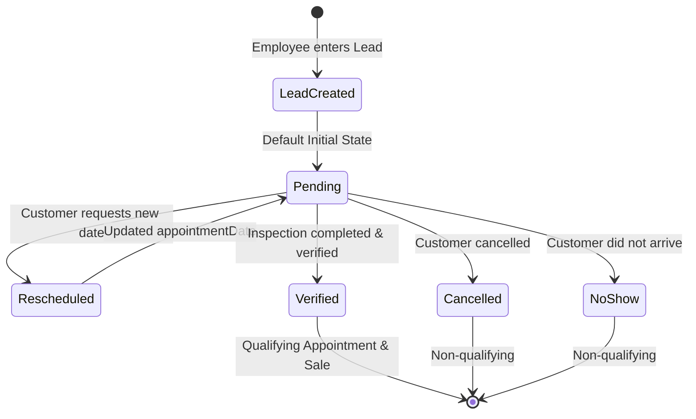
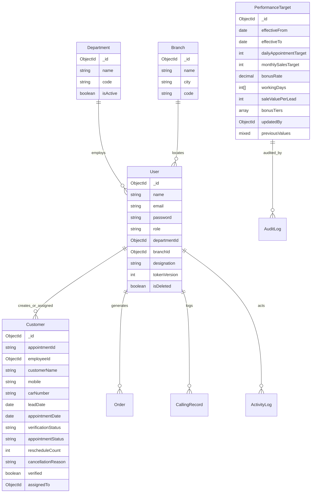

# Enterprise System Design Document
**Project**: GatecodeXcars24 Enterprise Management & Employee Performance Platform  
**Status**: Proposal / Review State  
**Version**: 2.0.0  
**Date**: October 1, 2026  

---

## 1. Problem Statement
The current application provides core CRM and operational logging features, but lacks an enterprise-grade performance engine, fine-grained access control, master-data management, and strict data-integrity enforcement. 

Specifically:
1. **Business Calculations**: Performance targets, achievements, and bonuses must be fully configurable from the admin console without hardcoding or client-side calculation risks.
2. **Access Control**: Operational security requires role-based access control (Super Admin, Admin, Manager, Team Leader, Employee, Viewer) with centralized permission enforcement to eliminate IDOR and unauthorized mutations.
3. **Data Integrity**: Appointment duplicates, unvalidated status transitions, and floating-point financial values must be prevented through database constraints and domain validations.
4. **Leaderboard & Analytics**: Performance metrics must support multi-dimensional filtering (by department, branch, designation, and custom timeframes) with deterministic tie-breaking.
5. **No Dummy / Fallback Data**: Every screen must reflect live, verified database records with graceful error, loading, and empty states.

---

## 2. Target Users & Persona Mapping

| Persona | Primary Needs & Responsibilities | Key Views & Actions |
| :--- | :--- | :--- |
| **Super Admin** | Full organizational control, system-wide configuration, audit oversight, tenant settings. | All screens, configuration console, audit logs, user management. |
| **Admin** | Daily operations management, target adjustments, bonus approvals, reporting exports. | Performance rankings, bonus reports, customer CRM, orders, calling reports. |
| **Manager** | Departmental / branch performance monitoring, team productivity oversight. | Team leaderboards, branch performance charts, appointment reviews. |
| **Team Leader (TL)** | Direct team lead management, appointment assignment, escalation management. | Team leads, daily appointment progress, calling records, WhatsApp notifications. |
| **Employee (Executive)** | Personal lead entry, appointment status tracking, daily/monthly target achievement review. | Executive dashboard, lead intake form, personal performance history, orders. |
| **Auditor / Viewer** | Compliance and reporting inspection without mutation rights. | Read-only access to dashboards, reports, and activity logs. |

---

## 3. Roles & Centralized Permission Model (RBAC)

### 3.1 Permission Matrix

| Resource | Action | Super Admin | Admin | Manager | Team Leader | Employee | Viewer |
| :--- | :--- | :---: | :---: | :---: | :---: | :---: | :---: |
| **Dashboard** | `read:summary` | ✅ | ✅ | ✅ (Dept/Branch) | ✅ (Team) | ✅ (Self) | ✅ |
| **Employees** | `create / update` | ✅ | ✅ | ❌ | ❌ | ❌ | ❌ |
| | `read:all` | ✅ | ✅ | ✅ (Branch) | ✅ (Team) | ❌ (Self only) | ✅ |
| **Appointments** | `create` | ✅ | ✅ | ✅ | ✅ | ✅ | ❌ |
| | `update:status` | ✅ | ✅ | ✅ | ✅ | ✅ (Assigned) | ❌ |
| | `delete` | ✅ | ✅ | ❌ | ❌ | ❌ | ❌ |
| **Performance Rules**| `read` | ✅ | ✅ | ✅ | ✅ | ✅ | ✅ |
| | `update:settings` | ✅ | ✅ | ❌ | ❌ | ❌ | ❌ |
| **Leaderboard** | `read:all` | ✅ | ✅ | ✅ | ✅ | ✅ (Team/Self) | ✅ |
| **Bonus Reports** | `read` | ✅ | ✅ | ✅ (Dept) | ❌ | ❌ (Own bonus) | ✅ |
| | `export:csv` | ✅ | ✅ | ✅ (Dept) | ❌ | ❌ | ❌ |
| **Audit Logs** | `read` | ✅ | ✅ | ❌ | ❌ | ❌ | ✅ |

### 3.2 Central Authorization API Pattern
Centralized authorization engine in `src/server/services/authorizationService.js`:
```javascript
export function can(user, action, resource, targetEntity = null) {
  // 1. Role capability check from permission policy table
  // 2. Ownership / Scoping check:
  //    - If role === 'employee', targetEntity must match user._id (or assignedTo)
  //    - If role === 'manager', targetEntity must belong to user.branchId/departmentId
  //    - If role === 'admin' || 'superadmin', grant access
}
```

---

## 4. End-to-End Workflows

### 4.1 Lead Intake & Appointment Lifecycle



1. **Lead Creation**: Executive submits customer name, mobile, car number, and preferred date. Unique appointment ID (`AP-XXXXX`) generated.
2. **Rescheduling / Cancellation**: Explicit state transition with mandatory reason field. Rescheduled appointments update `appointmentDate` and increment `rescheduleCount`.
3. **Verification**: Marked `Verified` by authorized staff/TL. Automatically sets `verified = true`, timestamping verification date. Only verified records qualify towards daily and monthly performance metrics.

---

## 5. Core Business Rules & Formulas

### 5.1 Daily Appointment Target
- **Configurable Setting**: `daily_appointment_target` (Default: `5` appointments / working day).
- **Working Day Check**: Monday–Saturday (configurable array `[1, 2, 3, 4, 5, 6]`).
- **Achievement Formula**:
  $$\text{dailyAppointmentAchievement} = \left(\frac{\text{completedAppointments}}{\text{dailyAppointmentTarget}}\right) \times 100$$
- **Qualifying Criteria**:
  - `verificationStatus === "Verified"`
  - `appointmentDate` (or fallback `leadDate`/`createdAt`) falls on target date
  - Assigned or created by the employee
- **Status Determination**:
  - If current time < 18:00 and `completed < target` $\rightarrow$ `In Progress`
  - If `completed > target` $\rightarrow$ `Target Exceeded`
  - If `completed === target` $\rightarrow$ `Target Met`
  - If day ended and `completed < target` $\rightarrow$ `Target Missed`

### 5.2 Monthly Sales Target
- **Configurable Setting**: `monthly_sales_target` (Default: `₹13,00,000` / month).
- **Sales Volume Source**:
  - Attributed value per verified inspection lead: `saleValuePerLead` (Default: `₹65,000`, reaching ₹13L at 20 appointments).
  - Optional Direct Vehicle Order volume from `Order.totalAmount` where applicable.
- **Formulas**:
  $$\text{salesAchievement} = \left(\frac{\text{achievedSales}}{\text{monthlyTarget}}\right) \times 100$$
  $$\text{remainingTarget} = \max(\text{monthlyTarget} - \text{achievedSales}, 0)$$

### 5.3 Bonus / Incentive Calculation
- **Configurable Setting**: `bonus_rate` (Default: `1%` / `0.01`).
- **Rule**: Bonus is calculated **strictly on excess sales above the target**, never on total sales.
- **Formulas**:
  $$\text{excessSales} = \max(\text{achievedSales} - \text{monthlyTarget}, 0)$$
  $$\text{bonus} = \text{excessSales} \times \text{bonusRate}$$
- **Slab-Ready Extensibility**:
  The database schema stores an array of incentive tiers for future expansion:
  ```json
  "bonusTiers": [
    { "minExcess": 0, "maxExcess": 200000, "rate": 0.01 },
    { "minExcess": 200001, "maxExcess": null, "rate": 0.02 }
  ]
  ```

### 5.4 Employee Leaderboard & Ranking Algorithm
1. **Primary Score**: `rankingScore` = $(0.5 \times \min(\text{apptAch}, 100)) + (0.5 \times \min(\text{salesAch}, 100))$
2. **Tie-Breaker 1**: Monthly Sales Volume ($\text{INR}$ descending)
3. **Tie-Breaker 2**: Uncapped Appointment Achievement Percentage (descending)
4. **Tie-Breaker 3**: Raw Completed Appointments Count (descending)
5. **Tie-Breaker 4**: Employee Name (alphabetical ascending for determinism)

---

## 6. Target Database Schema (Post-Migration)



### Key Integrity Constraints:
1. `Customer`: Compound index on `{ carNumber: 1, appointmentDate: 1 }` to prevent duplicate bookings for the same vehicle on the same date.
2. `User`: Unique index on `email` and sparse unique index on `username`.
3. `PerformanceTarget`: Append-only architecture with non-overlapping `effectiveFrom` and `effectiveTo` dates.
4. Monetary storage: All currency calculations maintain integer precision (paise representation).

---

## 7. Security Architecture
1. **Centralized RBAC Middleware**: Every route passes through `protect` $\rightarrow$ `requirePermission(action, resource)`.
2. **IDOR Remediation**:
   - `PUT /api/customers/:id`: Checks whether `req.user` is Admin/TL, or if `customer.employeeId === req.user._id` / `customer.assignedTo === req.user._id`.
   - `GET /api/employees/:id/performance`: Scoped strictly to Admin/Manager or the requesting employee themselves.
3. **Rate Limiting**:
   - Sliding-window rate limiter on `/api/auth/login` (5 attempts per minute per IP).
   - Rate limiting on heavy export endpoints (`/api/admin/bonus-report/export`).
4. **Input Validation**: Schema-level validation using `express-validator` with strict whitelisting to eliminate mass-assignment vulnerabilities.
5. **Audit Logging**: Every configuration mutation, customer deletion, and role modification creates an immutable `ActivityLog` entry.

---

## 8. Performance & Scalability Strategy
1. **Single-Pass MongoDB Aggregation**:
   Replace N+1 employee ranking queries with a unified `$facet` aggregation pipeline executing in under 100ms.
2. **Indexed Lookups**:
   - Case-insensitive lead lookup replaced with lowercased indexed search fields.
   - Compound indexes for period-based employee queries: `{ employeeId: 1, verificationStatus: 1, appointmentDate: 1 }`.
3. **Streaming CSV Exports**:
   Large reports utilize Node.js streams directly piping MongoDB query cursors to CSV response buffers without memory spikes.
4. **Live Synchronization**:
   Low-overhead visibility polling with intelligent pause when tab is inactive.

---

## 9. Non-Functional Requirements (NFRs)
- **Availability**: 99.9% uptime with database disconnection retry mechanisms.
- **Latency**: Sub-200ms p95 response time for dashboard KPI summaries and rankings.
- **Responsiveness**: Fluid layout across 375px (Mobile), 768px (Tablet), 1024px (Laptop), and 1440px+ (Desktop).
- **Accessibility**: WCAG 2.1 AA compliance (4.5:1 text contrast, accessible form labels, keyboard navigation).
- **Auditability**: 100% of target and configuration revisions recorded with actor ID, timestamp, and diff snapshots.

---

## 10. Out-of-Scope (for Current Release)
1. Multi-tenant multi-company white-labeling (system is tailored for GatecodeXcars24 operations).
2. Direct payment gateway integration (orders track bank name and payment references, but do not process card transactions).
3. Native mobile app (Android/iOS) development (supported via fully responsive Progressive Web App).

---

## 11. Open Questions for Final Sign-Off
1. **Sales Metric Attribution**: Confirm whether sales volume derives from **Verified Appointments $\times$ ₹65,000** (CRM inspection model) or from the **Order collection (`totalAmount`)** (direct car sale model). *(Recommended: Retain configurable verified appointment model as default, with toggle for order totals).*
2. **Tiered Bonus Tiers**: Shall we deploy the database schema supporting tiered slabs immediately while running the 1% flat excess bonus as the active rule? *(Recommended: Yes, allows future admin configuration without schema redesign).*
3. **Organizational Hierarchy**: Are Departments and Branches fixed at launch, or do you require a dedicated Admin Master Data CRUD screen right away?
